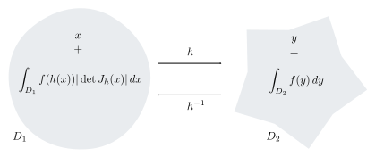

% Calcul Intégral III

<!-- LaTeX Macros -->
\newcommand{\N}{\mathbb{N}}
\newcommand{\Z}{\mathbb{Z}}
\newcommand{\Q}{\mathbb{Q}}
\newcommand{\R}{\mathbb{R}}
\renewcommand{\C}{\mathbb{C}}

\newcommand{\zero}{$\mathord{\boldsymbol{\circ}}$}
\newcommand{\one}{$\mathord{\bullet}$}
\newcommand{\two}{$\mathord{\bullet}\mathord{\bullet}$}
\newcommand{\three}{$\mathord{\bullet}\mathord{\bullet}\mathord{\bullet}$}
\newcommand{\four}{$\mathord{\bullet}\mathord{\bullet}\mathord{\bullet}\mathord{\bullet}$}

Objectifs d'apprentissage
================================================================================

Cette section s'efforce d'expliciter et de hiérarchiser
les acquis d'apprentissages associés au chapitre. 
Ces objectifs sont organisés en paliers :

(\zero) Prérequis (\one) Fondamental (\two) Standard (\three) Avancé
(\four) Expert

Sauf mention particulière, les objectifs "Expert", les démonstrations du document[^hp] 
et les contenus en annexe ne sont pas exigibles ("hors-programme").

[^hp]: L'étude des démonstrations du cours peut toutefois 
contribuer à votre apprentissage, au même titre que la résolution 
d'exercices.

#### Construction de l'intégrale dans $\R^n$

  - \one savoir définir un pavé de $\R^n$ (ou de $[-\infty, \infty]^n$),

  - \one savoir calculer son volume $n$-dimensionnel,

  - savoir comment exploiter dans ce cadre $n$-dimensionnel les concepts :

    - \two d'ensemble négligeable, 

    - \two de subdivision pointée, 

    - \one de somme de Riemman,

    - \two de jauge et de subdivision subordonnée,

    - \three d'intégrale de Lebesgue.

#### Ensembles et fonctions mesurables

  - savoir caractériser :

    - \two les ensembles de mesure finie et mesurables de $\R^n$,

    - \two les fonctions mesurables (critère de l'image réciproque),
    
    - \one les fonctions intégrables (critère d'intégrabilité dominée).

#### Propriétés de l'intégrale dans $\R^n$

  - savoir exploiter

    - \one la linéarité de l'intégrale,

    - \one sa croissance et l'inégalité triangulaire,

    - \two les relations entre intégrale et égalité presque partout,

    - \two les théorèmes de convergence.

#### Intégrale multiple

  - \one savoir calculer une intégrale dans $\R^n$ 
         au moyen de $n$ intégrales dans $\R$,

  - \one connaître les variantes de cette technique (ordre et nombre des variables),

  - \one connaître l'hypothèse d'intégrabilité validant ce calcul (Fubini),

  - \three connaître les propriétés des fonctions intermédiaires (Fubini),

  - \two savoir caractériser l'intégrabilité des fonctions positives (Tonelli),

  - \three connaître les propriétés des fonctions intermédiaires (Tonelli),

  - \two savoir caractériser l'intégrabilité des fonctions signées (via Tonelli).

#### Changement de variables

  - \one connaître la formule du changement de variables,

  - \two connaître les hypothèses du théorème et son résultat d'intégrabilité,

  - \two savoir appliquer le théorème de façon relativement directe,

  - \three savoir introduire un changement de variables quand c'est pertinent.

#### Théorème de la divergence

  - \four savoir caractériser un compact à bord $C^1$,  

  - \four savoir calculer la normale extérieure d'un tel ensemble,

  - \four connaître la définition d'intégrale de surface,

  - \four savoir exploiter le théorème de la divergence.     

Intégrale de fonctions de plusieurs variables
================================================================================

### Domaine des variables {.remark .ante #dv}
Comme pour les fonctions d'une seule variable, 
la théorie de l'intégrale de jauge des fonctions de plusieurs variables est 
applicable à des variables pouvant prendre des valeurs réelles ou infinies.
Mais il s'agit largement d'un 
"détail d'implémentation" : en pratique, le besoin que nous souhaitons
satisfaire, c'est l'intégration des fonctions de variables réelles ; 
pour nous conformer à ce cas d'usage principal, 
et après avoir construit l'intégrale dans le domaine $[-\infty,\infty]^n$, 
nous énoncerons uniquement les propriétés de l'intégrale dans le domaine $\R^n$. 
Quand il sera nécessaire de considérer une fonction de variables
réelles comme fonction de variables réelles étendues (pouvant être infinies), 
on prolongera la fonction initiale en lui assignant la valeur zéro 
dès qu'une de leur variables est infinie[^tav].
De façon similaire, il est possible de définir l'intégrale d'une fonction 
$f: A \to \R$ où $A \subset \R^n$ en la prolongeant par zéro sur $\R^n$ (ou directement 
sur $[-\infty, +\infty]^n$).

[^tav]: Toute autre valeur que zéro conviendrait aussi bien ici, car
la différence entre le domaine de définition du prolongement et le domaine 
initial est $[-\infty, \infty]^n \setminus \R^n$, qui est un ensemble négligeable
(cf. [exercice "domaine à l'infini"](#dai)). Dans le cas d'un domaine de
définition initial $A$ quelconque, il est par contre nécessaire 
de prolonger par zéro (au moins presque partout).

### Prolongements {.exercise .question .one #p}
A quelles fonctions de $[-\infty, +\infty]^2 \to \R$ sont associées 
la fonction $(x, y) \in \R^2 \mapsto \exp(-x^2-y^2) \in \R$, la fonction
$(x, y) \in \R^2 \mapsto \arctan (x^2 + y^2) \in \R$, la fonction 
$(x, y) \in [-1,1]^2 \mapsto 1 \in \R$ ?

### {.remark .ante}
Dans la suite, les pavés joueront pour l'intégration des fonctions de 
plusieurs variables le rôle qui était dévolu aux intervalles pour les fonctions 
d'une variable :

### Pavés {.definition}
On appelle *pavé* de $[-\infty,+\infty]^n$ tout ensemble $I$ de la forme
$$
I = I_1 \times \dots \times I_n
$$
où les $I_i$ sont des intervalles de $[-\infty,+\infty]$.

![Réprésentation du pavé $[1,3] \times [1, 2]$ du plan (étendu).](images/pavé.svg)

### Partition en pavés {.exercise .question .one #pp}
Montrer que l'ensemble $\R^2 \setminus [-1,1]^2$ peut être partitionné en
4 pavés. 

### Volume d'un pavé
On appelle *volume $n$-dimensionnel* (ou parfois simplement *volume*
quand le contexte est clair) du pavé 
$I = I_1 \times \dots \times I_n$ de $[-\infty,+\infty]^n$ la valeur
$$
\lambda(I) := \ell(I_1) \times \dots \times \ell(I_n) \in \left[0, +\infty \right],
$$
en adoptant la convention que $0 \times \infty = 0$.

### Longueur, aire, volume {.remark}
On pourra continuer à appeler cette grandeur
*longueur* plutôt que *volume $n$-dimensionnel* si l'on travaille dans $\R$ 
(ou $[-\infty,+\infty]$) ; 
dans $\R^2$ (ou $[-\infty,+\infty]^2$) il est approprié 
de la désigner sous le terme d'*aire* et dans $\R^3$ (ou $[-\infty, +\infty]^3$)
sous le terme de *volume*. On pourra dans ces trois cas particuliers préférer
les notation $\ell$, $a$ et $v$ au symbole $\lambda$.

### Volume de pavés {.exercise .question .one #exo-volume-pavé}
Calculer l'aire des pavés $\{(0,0)\}$, $[-1, 1]^2$, $[-1, 1] \times [0, +\infty]$
et $\{0\} \times \R$ de $[-\infty, +\infty]^2$.

### Ensemble négligeable  {.definition .two #ensemble-négligeable}
Un ensemble $A$ de $[-\infty, +\infty]^n$ est *négligeable* si pour tout
$\varepsilon > 0$, il existe une collection dénombrable de pavés 
$I_1$, $I_2$, $\dots$, de $[-\infty,+\infty]^n$ qui
recouvre l'ensemble $A$ -- telle que $A \subset \bigcup_{i} I_i$ -- 
et vérifiant
$$
\sum_i \lambda(I_i) \leq  \varepsilon.
$$

### Domaine à l'infini {.exercise .question .one #dai}
Montrer que l'ensemble $[-\infty,+\infty]^n \setminus \R^n$ est d'aire
négligeable.

### Graphe du sinus {.exercise .question .two #gs}
Montrer que l'ensemble 
$$G = \{(x, \sin x) \; | \; x \in [0, 2\pi]\}$$ 
est d'aire négligeable.

![Graphe de la fonction $\sin$ sur $[0, 2\pi]$.](images/sin.py)

### Presque partout {.definition}
Une propriété $P$ dépendant d'un vecteur $x \in [-\infty,\infty]^n$ est vraie *presque partout*
si l'ensemble des points $x$ où elle est fausse est un ensemble
négligeable. On pourra utiliser la notation "$P$ p.p." ou "$P(x)$ p.p." 
pour signifier que la propriété $P$ est vraie presque partout.

### Subdivision pointée
Une *subdivision pointée* du pavé fermé $I$ de 
$[-\infty,+\infty]^n$ est 
une famille finie 
$$
\{(t_i, J_i) \; | \; \; 0 \leq i \leq k-1\}
$$
où les $J_i$ sont des pavés fermés de $I$ *sans chevauchement*
(les intersections deux à deux des pavés de cette collection 
sont des ensembles négligeables)
qui recouvrent $I$ et tels que 
$t_i \in J_i$ pour tout $i \in \{0, \dots, k-1\}.$

![Une subdivision pointée de $[-\infty, \infty]^2$ comportant 12 pavés.](images/pavage.svg)

### Somme de Riemman {.definition}
La *somme de Riemann* associée à la fonction $f:I \to \mathbb{R}$,
où $I$ est un pavé fermé de $[-\infty,+\infty]^n$, 
et à la subdivision pointée $\mathcal{D}$ 
de $I$ est la grandeur
$$
S(f, \mathcal{D}) = \sum f(t) \lambda(J), \; \; (t, J) \in \mathcal{D}, \, \lambda(J) < + \infty.
$$

### Jauge {.definition}
Une *jauge* $\gamma$ sur un pavé fermé $I$ de $[-\infty,+\infty]^n$ est une 
fonction qui associe à tout $t \in I$ un 
pavé ouvert $\gamma(t)$ de $[-\infty,+\infty]^n$ contenant $t$. 

### Subdivision pointée subordonnée à une jauge {.definition}
Une subdivision $\mathcal{D}$ du pavé fermé $I$ de $[-\infty,+\infty]^n$
est *subordonnée à une jauge* $\gamma$ sur $I$ si pour tout 
$(t, J) \in \mathcal{D}$, $J \subset \gamma(t).$

### Intégrale dans $\mathbb{R}^n$ {.definition}
Une fonction $f:[-\infty,\infty]^n \to \R$ est dite *intégrable 
au sens de Henstock-Kurzweil* s'il existe un réel $A$ tel
que pour tout $\varepsilon > 0$ il existe une jauge $\gamma$ de 
$[-\infty,+\infty]^n$ telle que pour 
toute subdivision pointée $\mathcal{D}$ de $[-\infty,+\infty]^n$
subordonnée à $\gamma$, on ait
$|S(f, \mathcal{D}) - A| \leq \varepsilon$.
Le réel $A$ quand il existe est unique ; 
il est appelé *intégrale de Henstock-Kurzweil de $f$ sur $\R^n$*.

La fonction $f$ est dite *intégrable (au sens de Lebesgue)* si $f$ et $|f|$ sont
intégrables au sens de Henstock-Kurzweil. L'intégrale (de Lebesgue) de $f$ est alors
définie comme l'intégrale de Henstock-Kurzweil de $f$ et notée
$$
\int f \; \mbox{ ou } \;
\int f(x) \, dx \; \mbox{ ou } \; \int f(x_1,\dots, x_n) \, dx_1\dots dx_n.
$$
Lorsque la fonction $f$ est définie sur $A \subset [-\infty,\infty]^n$ 
on dira que $f$ est intégrable sur $A$ si son prolongement $\bar{f}$
par zéro à $[-\infty, \infty]^n$ est intégrable sur $[-\infty,\infty]^n$ ;
s'il est nécessaire
d'être explicite quant au domaine d'intégration $A$, on utilisera les notations
$$
\int_A f := \int_A f(x) \, dx := \int \bar{f}(x) \, dx.
$$

<!--
### {.post}
Comme dans le cas réel, la définition supposerait que $f$ soit a priori
définie sur $[-\infty,+\infty]^n$ plutôt que sur $\R^n$ ; 
mais on peut étendre $f$ pour des arguments à l'infini 
(dont au moins l'un des arguments est infini) 
sans que l'intégrabilité de cette extension ou la valeur de son intégrale
ne soient affectés par le choix de ces valeurs.
-->

### Propriétés élémentaires

Dans cette section, nous énonçons sans preuve dans le cadre $\R^n$
les propriétés de l'intégrale déjà connues dans $\R$.

### Linéarité {.theorem .one #linéarité}
Si les fonctions $f: \R^n \to \mathbb{R}$ et 
$g: \R^n \to \mathbb{R}$ sont intégrables et 
$\alpha \in \mathbb{R}$, alors les fonctions $f+g$ et $\alpha f$ sont intégrables. 
De plus,
$$
\int f(x) + g(x) \, dx 
= 
\int f(x) \, dx +
\int  g(x) \, dx
\;
\mbox{ et }
\;
\int  \alpha f(x) \, dx
=
\alpha \int f(x) \, dx.
$$

### Additivité I {.exercise .question .one #exo-additivité-I}
Soit $f :\R^n \to \R$. Montrer que si $f$ est intégrable sur $A \subset \R^n$ 
et sur $B \subset \R^n$ et que $A$ et $B$ sont d'intersection vide 
alors $f$ est intégrable sur $A\cup B$ et
$$
\int_{A \cup B} f(x) \, dx = \int_A f(x) \, dx + \int_B f(x) \, dx.
$$

<!--

**TODO:** que faire avec ça ? Il y a une adaptation trivale où les ensembles
$A$ et $B$ sont disjoints, une autre dans le cas ou l'intersection est 
négligeable, mais alors ça n'est pas le moment adéquat dans l'ordre des
notions.

### Additivité {.theorem #additivité .one}
Si la fonction $f$ est définie et intégrable sur les intervalles
$[a, b]$ et $[b, c]$, alors elle est intégrable sur l'intervalle $[a, c]$
et
$$
\int_a^b f(t) \, dt + \int_b^c f(t) \, dt = \int_a^c f(t) \, dt.
$$

**TODO.** Même chose : la version "élémentaire" n'est plus guère utile ici ;
il faut restreindre $f$ à une ensemble mesurable, c'est la version "chapitre 2"
qui devient pertinente.

### Restriction {.theorem #restriction .one}
Si $f$ est intégrable sur l'intervalle $[a, b]$, 
elle est intégrable sur tout intervalle $[c, d]$ 
inclus dans $[a, b]$.

-->

### Croissance de l'intégrale {.proposition .one #croissance}
Si les fonctions $f: \R^n \to \mathbb{R}$ et 
$g: \R^n \to \mathbb{R}$ sont intégrables et que
$f \leq g$, alors
$$
\int f(x) \, dx \leq \int g(x)\,dx.
$$

### Inégalité triangulaire {.corollary #inégalité-triangulaire}
Si $f: \R^n \to \R$ est intégrable alors $|f|$ est intégrable et
$$
\left|\int f(x) \, dx \right| \leq \int |f(x)|\, dx.
$$

### Fonctions égales presque partout {.proposition #fepp .two}
Une fonction $f:\R^n \to \R$ égale presque partout à une 
fonction $g:\R^n \to \R$ intégrable est elle-même intégrable
et 
$$
\int f(x) \, dx = \int g(x) \, dx.
$$

### Fonctions égales presque partout (réciproque) {.proposition #fepp-réciproque .two}
Si les fonctions $f:\R^n \to \R$ et $g: \R^n \to \R$ sont intégrables
et si 
$$
f \leq g \, \mbox{ presque partout} 
\; \mbox{ et } \;
\int f(x) \, dx \geq \int g(x) \, dx,
$$
alors $f = g$ presque partout.

### {.remark}
Un théorème de changement de variables généralise le théorème
déjà énoncé pour une variable ; il est suffisamment complexe pour mériter 
[sa propre section dans ce chapitre](#changement-de-variables).
L'équivalent dans $\R^n$ du théorème fondamental du calcul est le théorème
de la divergence[^pe] ; [l'annexe](#annexe) lui est entièrement 
consacrée.

[^pe]: même si cela ne saute pas forcément aux yeux !

### {.remark .ante}
La notion d'ensemble mesurable est inchangée (modulo le remplacement des
intervalles fermés bornés de $\R$ par les pavés fermés bornés de $\R^n$) ; 
les trois propriétés élémentaires de la collection des ensembles mesurables 
de $\R^n$
sont toujours vérifiées (la collection est une tribu), cette famille contient
tous les fermés (et tous les ouverts) et "négligeable" et 
"(mesurable et) de mesure ($n$-dimensionnelle) nulle" sont toujours synonymes.

### Ensemble mesurable {.definition #def-em}
Un ensemble $E$ de $\R^n$ est *de mesure (de Lebesgue ou $n$-dimensionnelle)
finie* si sa fonction caractéristique $1_E$ est intégrable sur $\R^n$ ; 
il est *mesurable* si sa fonction caractéristique est intégrable 
sur tout pavé fermé borné de $\R^n$.
La *mesure (de Lebesgue ou $n$-dimensionnelle)* $\lambda(E)$ 
d'un ensemble $E$ mesurable est définie par
$$
\lambda(E) := \int 1_E(x) \, dx
$$
si $E$ est de mesure finie et
$$
\lambda(E) := +\infty
$$
dans le cas contraire (si $E$ est mesurable mais pas de mesure finie).

### Propriétés élémentaires (tribu) {.theorem #pptés-tribu}

 1. L'ensemble vide est mesurable.

 2. Le complémentaire d'un ensemble mesurable est mesurable.

 3. L'union d'une collection dénombrable d'ensembles mesurables
    est mesurable.

### Topologie et ensembles mesurables {.theorem #OSM}
Tout ensemble fermé (ou ouvert) est mesurable.

### Disque fermé {.exercise .question .one #df}
Montrer que le disque $D = \{(x_1,x_2) \in \R^2 \; | \; x_1^2 + x_2^2 \leq 1\}$
est mesurable.

### Ensembles négligeables {.theorem #négligeable-longueur-nulle}
Un ensemble est de mesure de Lebesgue nulle si et seulement s'il est négligeable.

### Additivité II {.exercise .question .two #exo-additivité-II}
Soit $f :\R^n \to \R$. Montrer que si $f$ est intégrable sur $A \subset \R^n$ 
et sur $B \subset \R^n$ et que $A$ et $B$ sont sans chevauchement 
($A\cap B$ est négligeable) alors $f$ est intégrable sur $A\cup B$ et
$$
\int_{A \cup B} f(x) \, dx = \int_A f(x) \, dx + \int_B f(x) \, dx.
$$

### {.remark .ante}
Les fonctions mesurables ont la même définition que dans $\R$ ; 
le critère de mesurabilité par l'image réciproque est toujours valide. 

### Fonction mesurable {.definition}
Une fonction $f:\R^n \to \R$ est *mesurable* 
si elle est la limite simple d'une suite de fonctions intégrables,
c'est-à-dire s'il existe une suite de fonctions intégrables 
$f_k:\R^n \to \R$ telle que 
pour tout $x\in \R$, 
$f_k(x) \to f(x)$ quand $k \to +\infty$.
Une fonction $f:\R^n \to \R^m$ est mesurable 
si chacune de ses composantes est mesurable.

### Critère de l'image réciproque {.theorem #CIR}
Une fonction $f:\R^n \to \R^m$ est mesurable si et seulement
l'image réciproque de tout fermé (ou de tout ouvert) de $\R^m$
par $f$ est mesurable.

### Ensemble mesurable {.proposition #emfc}
Un sous-ensemble $E$ de $\R^n$ est mesurable si et seulement si sa fonction
caractéristique $1_E$ est mesurable.

#### {.remark .ante}
Un cas particulier important sans équivalent dans $\R$ : les produits d'ensembles
mesurables sont mesurables.

### Produit d'ensembles mesurables
Si les ensembles $A \subset \R^m$ et $B \subset \R^n$ sont mesurables, 
alors leur produit cartésien $A \times B \subset \R^m \times \R^n$ est mesurable.

#### Démonstration {.proof}
Comme $A \times B = (A \times \R^n) \cap (\R^m \times B)$ et que 
[l'intersection de deux ensembles mesurables est mesurable](#pptés-tribu),
il suffit d'établir que $A \times \R^n$ et $\R^m \times B$ sont mesurables.
Nous nous contenterons de prouver que $A \times \R^n$ est mesurable,
la preuve pour $\R^m \times B$ étant presque identique.

Soient $P_1$ et $P_2$ deux pavés fermés arbitraires 
de $\R^m$ et $\R^n$ respectivement ;
nous allons établir que la fonction $(x, y) \in P_1 \times P_2 \to 1_{A}(x)$
est intégrable. Cela montrera que $(x, y) \in \R^m \times \R^n \to 1_A(x) \times 1_{\R^n}(y)$
est mesurable [et donc que $A \times \R^n$ est mesurable](#emfc).

Par construction, $A \cap P_1$ est de mesure finie [donc $1_{A \cap P_1}$ est 
intégrable](#def-em). Soit $\varepsilon > 0$ et $\gamma_1$ une jauge sur $\R^m$ telle
que pour toute subdivision pointée $\mathcal{D}_1$ de $P_1$ subordonnée à $\gamma_1$ 
on ait
$$
\left|S(1_{A}, \mathcal{D}_1) - \int_{P_1} 1_{A}(x) \, dx\right| \leq \varepsilon.
$$
Soit $\gamma$ la jauge sur $P_1 \times P_2$ définie par 
$$
\gamma(x, y) = \gamma_1(x) \times [-\infty,+\infty]^m.
$$
Soit $\mathcal{D}$ une subdivision pointée de $P_1 \times P_2$ subordonnée à
$\gamma$. Soit $\mathcal{I}_2$ une collection de $p$ pavés fermés sans chevauchement
tels que si $I_1 \times I_2$ appartienne à $\mathcal{D}$ alors $I_2$ est l'union
d'un nombre fini d'éléments de  $\mathcal{I}_2$. 
En jouant sur le fait que les valeurs de $(x, y) \mapsto 1_{A}(x)$ 
sont indépendantes de $y$
et en décomposant les pavés de $\mathcal{D}_1$ selon leur seconde composante, 
on peut trouver $p$ subdivisions pointées $\mathcal{D}_1^i$ de $P_1$ toutes subordonnées
à $\gamma_1$ et des réels positifs $\alpha_i$ tels que $\sum_{i=1}^p \alpha_i = \lambda(P_2)$ et
$$
S((x, y) \mapsto 1_{A}(x), \mathcal{D}) = \sum_{i=1}^p \alpha_i S(1_A, \mathcal{D}_1^i).
$$
Par conséquent,
$$
\left|S((x, y) \mapsto 1_{A}(x), \mathcal{D}) - \lambda(P_2)\int_{P_1\times P_2} 1_{A}(x) \, dx \right| \leq \lambda(P_2) \varepsilon
$$
et $(x, y) \in P_1 \times P_2 \mapsto 1_{A}(x)$ est donc bien intégrable.

### {.remark .ante}
Les théorèmes de convergence (dominée, monotone) et le critère d'intégrabilité
dominée se transposent à l'identique pour les fonctions de plusieurs variables.

### Théorème de convergence dominée {#TCD .theorem}
Si une suite de fonctions intégrables $f_k:\R^n \to \R$
converge simplement vers la fonction $f$, c'est-à-dire si pour tout
$x \in \R^n$,
$$
\lim_{k \to +\infty} f_k(x) = f(x)
$$
et qu'il existe une fonction intégrable $g:\R \to \left[0, +\infty\right[$ 
dominant la suite $f_k$, c'est-à-dire telle que pour tout $k \in \N$ 
et pour tout 
$x \in \R^n$,
$$
|f_k(x)| \leq g(x)
$$
alors la fonction $f$ est intégrable et 
$$
\int f(x) \, dx 
=
\int \lim_{k \to +\infty} f_k(x) \, dx
= 
\lim_{k \to +\infty} \int f_k(x) \, dx.
$$

### Théorème de convergence monotone {#TCM .theorem}
Si une suite de fonctions intégrables $f_k:\R^n \to \R$
est croissante et majorée en tout point, c'est-à-dire si pour tout
$x$ de $\R^n$ 
$$
\mbox{pour tout } \, k \in \N, \, f_k(x) \leq f_{k+1}(x) 
\; \mbox{ et } \;
\sup_k f_k(x) < + \infty,
$$
alors la limite simple $f$ des $f_k$ est intégrable si et seulement si 
$$
\sup_k \int f_k(x) \, dx < +\infty.
$$
et dans ce cas,
$$
\int f(x) \, dx 
=
\int \lim_{k \to +\infty} f_k(x) \, dx
= 
\lim_{k \to +\infty} \int f(x) \, dx.
$$

### Critère d'intégrabilité dominée {.theorem #CID}
Une fonction $f: \R^n \to \R$ est intégrable si et seulement
si $f$ est mesurable et il existe une fonction intégrable
$g: \R \to \left[0,+\infty\right[$ telle que $|f| \leq g$.

Intégrale multiple
================================================================================

### Théorème de Fubini {.theorem #Fubini}
Soit $f: \mathbb{R}^m\times \mathbb{R}^n \to \mathbb{R}$ 
une fonction intégrable.
Alors la fonction partielle $x \in \mathbb{R}^m \mapsto f(x, y)$ est intégrable 
pour presque tout $y \in \mathbb{R}^n$, la fonction définie presque partout
$$
y \in \R^n \mapsto \int_{\R^m} f(x, y) \, dx
$$
est intégrable et
$$
\int_{\mathbb{R}^{m+n}} f(x, y) \, dxdy = \int_{\mathbb{R}^n} \left[ \int_{\mathbb{R}^m} f(x, y) \, dx\right] dy.
$$

### Ordre et nombre des variables {.remark .post #Fubini-extension}
Deux extensions [du théorème de Fubini](#Fubini) souvent utiles :

  - Il est possible de changer l'ordre d'intégration des variables :
    si $f$ est intégrable, alors la fonction partielle 
    $y \in \mathbb{R}^n \mapsto f(x, y)$ est intégrable pour presque tout 
    $x \in \mathbb{R}^m$, la fonction définie presque partout
    $$
    x \in \R^m \mapsto \int_{\R^n} f(x, y) \, dy
    $$
    est intégrable et
    $$
    \int_{\mathbb{R}^{m+n}} f(x, y) \, dxdy =
    \int_{\mathbb{R}^m} \left[ \int_{\mathbb{R}^n} f(x, y) \, dy\right] dx.
    $$

  - Il est possible de considérer des fonctions de trois variables ou plus. 
    Par exemple, si la fonction $f : \R^m \times \R^n \times \R^p \to \R$ 
    est intégrable, alors
    $$
    \int_{\mathbb{R}^{m+n+p}} f(x, y, z) \, dxdydz =
    \int_{\R^p} \left[\int_{\mathbb{R}^n} \left[ \int_{\mathbb{R}^m} f(x, y, z) \, dx\right] dy \right] dz.
    $$
    (étant entendu que tous les fonctions intermédiaires intervenant dans le membre de droite
    de cette équation sont bien définies presque partout).

### Démonstration {.proof}
Se reporter à @Swa01.

### Calcul de l'aire d'un triangle {.exercise .question .one #triangle}
Considérons le triangle 
$$
T = \{(x, y) \in \R^2 \; | \; x \geq 0, \, y \geq 0 \mbox{ et } x + y \leq  1\}.
$$
En supposant  l'intégrale ci-dessous bien définie, calculer :
$$
a(T) = \int_{\R^2} 1_T(x, y) \, dxdy.
$$

### Contre-exemple {.exercise .question .two #fubini-counter-example}
Comparer les valeurs des intégrales multiples
$$
\int_0^1 \left[\int_0^1 \frac{x^2 - y^2}{(x^2+y^2)^2} \, dx \right] \, dy
\; \mbox{ et } \;
\int_0^1 \left[\int_0^1 \frac{x^2 - y^2}{(x^2+y^2)^2} \, dy \right] \, dx,
$$
puis expliquer le résultat.
Indication : on remarquera que
$$
\frac{x^2 - y^2}{(x^2+y^2)^2} = \frac{\partial}{\partial x} \left(-\frac{x}{x^2+y^2}\right) 
$$
<!--
 =
-\frac{\partial}{\partial x} \left(\frac{\partial}{\partial y} \arctan \frac{y}{x} \right).
$$
-->

### {.ante .post .remark}
Pour pouvoir appliquer le théorème de Fubini, il faut savoir 
a priori que la fonction est intégrable et pas seulement que ses intégrales
multiples sont bien définies (cf. ["Contre-exemple" ci-dessus](#fubini-counter-example)). 
Si la fonction est à valeurs positives toutefois,
l'examen de ses intégrales multiples permet de s'assurer de l'intégrabilité ;
c'est le théorème de Tonelli :

### Théorème de Tonelli {.theorem #Tonelli}
Soit $f: \mathbb{R}^m\times \mathbb{R}^n \to \left[0, +\infty\right[$ 
une fonction mesurable. Alors, pour presque tout $y \in \R^n$, la fonction 
$x \in \R^m \mapsto f(x, y)$ est mesurable. Si de plus pour presque tout 
$y \in \R^n$ cette fonction est intégrable, 
alors la fonction (définie presque partout)
$$
g : y \in \R^n \mapsto \int_{\mathbb{R}^m} f(x, y) \, dx
$$
est mesurable. Si elle est intégrable, alors la fonction 
$f$ est intégrable. 
Réciproquement, si $x \in \R^m \mapsto f(x, y)$ n'est pas intégrable
presque partout ou que la fonction $g$ n'est pas intégrable, 
alors $f$ n'est pas intégrable.

### Démonstration {.proof}
Se reporter à @Swa01.

### Fubini-Tonelli, mode d'emploi {.remark}
Les deux théorèmes sont souvent utilisés ensemble
pour intégrer une fonction $f : \R^m \times \R^n \to \R$,
de la façon suivante :

 1. On vérifie tout d'abord que la fonction $f$ est mesurable. 
    Comme sa valeur absolue $|f|$ est mesurable et positive, 
    le théorème de Tonelli est alors *susceptible* de lui être appliqué.
    
 2. On étudie si $|f|$ satisfait bien [toutes les hypothèses du théorème
    de Tonelli](#Tonelli). Si c'est le cas, la fonction $|f|$ est intégrable ; 
    la fonction $f$ étant mesurable, [par le critère 
    d'intégrabilité dominée](#CID), $f$ est donc intégrable. 
    
 3. [Le théorème de Fubini](#Fubini) est donc applicable ! 
    On peut donc évaluer l'intégrale de $f$ en calculant son
    intégrale multiple.

### Triangle d'aire finie {.exercise .question .one #triangle2}
Montrer que le triangle
$$
T = \{(x, y) \in \R^2 \; | \; x \geq 0, \, y \geq 0 \mbox{ et } x + y \leq  1\}
$$
est d'aire finie, c'est-à-dire que $1_T$ est intégrable.

### Intégrabilité des pavés fermés bornés {.exercise .question .one #ipfb}
Montrer que la fonction caractéristique $1_I$ du  pavé 
$I = [a_1,b_1] \times \dots \times [a_n,b_n]$ de $\R^n$ est intégrable et
que 
$$
\lambda(I) := \int 1_I(x) \, dx = (b_1 - a_1) \times \dots \times (b_n - a_n).
$$

### Tout droite du plan est négligeable {.exercise .two .question #dn}
En utilisant les [théorèmes de Tonelli](#Tonelli) [et Fubini](#Fubini), 
montrer que toute droite du plan est négligeable.

Changement de variables {#changement-de-variables}
================================================================================

### Changement de variables {.theorem #theorem-changement-de-variables}
Soient $D_1$ et $D_2$ des ouverts de $\mathbb{R}^n$ et 
$h: D_1 \to D_2$ un $C^1$-difféomorphisme de $D_1$ sur $D_2$ :
une fonction continûment différentiable et bijective
dont l'inverse $h^{-1}: D_2 \to D_1$ est également continûment différentiable. 
La matrice jacobienne associée à la différentielle de $h$ étant notée $J_h$,
la fonction $f: D_2 \to \mathbb{R}$ est intégrable
si et seulement si la fonction $(f \circ h) |\det J_h| : D_1 \to \mathbb{R}$ 
est intégrable et dans ce cas,
$$
\int_{D_2} f(y) \, dy = \int_{D_1} f(h(x)) |\det J_h(x)| \, dx.
$$

### Démonstration {.proof}
Se reporter à [@Swa01, annexe 5].

### Homothétie {.exercise .question .one #h}
Soit $f:\R^n \to \R$ une fonction intégrable. Montrer que pour tout
coefficient $\alpha > 0$, l'intégrale
$$
\int_{\R^n} f(\alpha x) dx
$$
est bien définie et la calculer en fonction de l'intégrale de $f$ sur $\R^n$.

### Volume et translation {.exercise .question .one #vr}
Montrer que si $A$ est mesurable et de volume fini dans $\R^3$
l'image de $A$ par une translation est également mesurable et de même volume.

### Coordonnées polaires {.exercise .question .two #cp}
Soit 
$$
C = \{(x, y) \in \R^2 \; | \; y \neq 0 \mbox{ ou } x > 0\}
\; \mbox{ et } \;
P = \{(r,\theta) \in \R^2 \; | \; r>0 \mbox{ et } -\pi < \theta < \pi\}.$$ 
On note $h$ la fonction de $P$ dans $C$ définie par
$h(r, \theta) = (r \cos \theta, r \sin \theta)$.
Montrer que pour toute fonction $f: C \to \R$ intégrable, si l'on pose
$g(r,\theta) = f(x, y)$ où $(x, y) = h(r,\theta)$, alors
$$
\int_{C} f(x, y) \, d(x,y) = \int_{P} g(r,\theta)  r \, d(r, \theta).
$$

### Absence du déterminant jacobien {.exercise .question .two #adj}
Supposons $D_1$, $D_2$, $h$ et $f$ conformes aux hypothèses [du théorème de 
changement de variables](#theorem-changement-de-variables). On suppose 
de plus que $f \circ h$ est intégrable sur $D_1$. Exprimer l'intégrale
$$
\int_{D_1} f (h(x)) \, dx
$$
comme une intégrale sur $D_2$.

<!--
### Intégrale de Henstock-Kurzweil {.post .remark}
Il s'avère que le théorème de Fubini est encore valable si l'on raisonne 
avec l'intégrale de Henstock-Kurzweil plutôt qu'avec l'intégrale de Lebesgue. 
Mais cela n'est pas le cas du théorème de changement de variable : 
on peut en effet exhiber une fonction $f:\R^2 \to \R$ qui soit 
intégrable au sens de Henstock-Kurzweil,
mais telle que quand $h$ désigne la rotation centrée à l'origine d'angle
$\pi/4$, la fonction $f \circ h$ ne soit pas intégrable[^ref-ai].
Comme dans ce cas on a $|\det J_h| = 1$ sur tout $\R^2$, cela contredit
la conclusion du théorème de changement de variables.
Compte tenu de l'importance pratique qu'a le théorème de changement de 
variable, c'est une motivation importante pour privilégier l'intégrale de 
Lebesgue à cette de Henstock-Kurzweil.

[^ref-ai]: cf. [@Swa01, ex. 29, p. 98].

La situation de l'intégrale de Henstock-Kurzweil vis-à-vis de l'intégrale 
Lebesgue à un parallèle dans le contexte des séries réelles, selon que
l'on considère la convergence classique ou absolue
On sait en effet que si la série $\sum_k a_k$ est absolument convergente 
($\sum_k a_k$ est convergente ainsi que $\sum_k |a_k|$), 
un réordonnancement des termes de la série -- un "changement de variable"
-- n'a pas d'effet, ni sur la convergence de la série ni sur la valeur de 
la somme ; pour toute bijection $\sigma: \N \to \N$,
$$
\sum_{k=0}^{+\infty} a_{\sigma(k)} = \sum_{k=0}^{+\infty} a_{k}.
$$
Par contre, si $\sum_k a_k$ est conditionnellement convergente 
(c'est-à-dire convergente, mais telle que $\sum_k |a_k|$ soit divergente ; 
par exemple, $a_k = (-1)^k / (k+1)$), il existe un réordonnancement 
$\sigma$ tel que $\sum_k a_{\sigma(k)}$ n'ait pas de limite 
(ni finie ni infinie).
Pour toute valeur limite 
$\ell \in [-\infty, +\infty]$ souhaitée de la somme, 
on peut aussi construire un réordonnancement $\sigma$ tel que
$$
\sum_{k=0}^{+\infty} a_{\sigma(k)} = \ell.
$$
-->

<!--
### TODO
Mention du fait qu'il est vraiment nécessaire de chercher l'absolue
intégrabilité. Retrouver la référence qui cite qu'avec une simple
rotation et l'intégrabilité conditionnelle ça ne marche pas.
C'est dans le Bullen -- Non-Absolute Integrale, mais pas détaillé
(Q: le texte utilise une rotation de $\pi/4$ pour le contre-exemple.
Avec une rotation de $\pi/2$ ça marcherait ?).
Un exemple détaillé est donné dans 
"Petit traité d'intégration: Riemann, Lebesgue et Kurzweil-Henstock" 
(Jean-Yves Briend). L'exemple est compréhensible et intéressant;
peut faire l'objet d'un exercice technique semble faisable.
(note: aussi exercice similaire dans le Swarz)
-->

<!--

Tracer un parralèle avec les séries, ou il est connu que les séries
conditionnellement convergentes ne gardent pas cette propriété par
réordonnancement (exemple mono-dim ou bi-dim) ?

-->

Annexe -- Théorème de la divergence {#annexe}
================================================================================

<!--
### TODO:
Deux façon raisonnables de définir un compact à bord sont données;
la troisème (localement demi-espace après transfo par difféo) peut trouver
sa place en exo ?
-->

### Compact à bord régulier {.definition #cbr}
Un sous-ensemble $K$ de $\mathbb{R}^n$ est *un compact à bord $C^1$*
s'il est compact (fermé et borné) et peut être caractérisé au voisinage de tout point de
sa frontière $\partial K$, 
et après un éventuel changement de repère,
comme l'*hypographe* -- l'ensemble des points en-dessous du graphe -- 
d'une fonction continûment différentiable.
Autrement dit, pour tout point $x_0 \in \partial K$, 
il existe une application affine inversible $T: \R^n \to \R^n$ et
un voisinage ouvert $V$ de $x_0$ de la forme $V = T(U \times I)$,
où $U$ est un ouvert de $\mathbb{R}^{n-1}$ et $I$ 
est un intervalle ouvert de $\mathbb{R}$, et une fonction 
$f: U \to I$ continûment différentiable tels que
$$
K \cap V = T\left(\{(y_1,\dots, y_n) \in U \times I \; | \;  y_n \leq f(y_1, \dots, y_{n-1})\}\right).
$$

### Changement de repère orthonormé {.remark #cbr-isom}
Il est possible d'imposer dans [la définition des compacts à bord $C^1$](#cbr)
que $T$ soit une isométrie directe (qui conserve la distance et l'orientation) ; 
cela revient à n'autoriser que les changements de repère orthonormés directs. 
La caractérisation des compacts
à bord $C^1$ qui en résulte est inchangée.

<!--
### TODO

Faire passer l'idée d'un ensemble borné délimité par une surface
$n-1$-dimensionelle (une "hypersurface"), "suffisamment régulière"
et qu'il n'y a plus qu'à trouver une façon de mesurer cette régularité.

### TODO

Vérifier qu'il n'est pas nécessaire (?) de spécifier indépendamment 
intérieur et frontière comme dans [@DZ11, p. 87].

Lister qq conséquences du fait d'être compact à bord (tq: adhérence de 
l'intérieur est l'ensemble, etc.), etc.
Notation $\Omega$, $\Gamma$, etc.
Caractériser la frontière de $K$ comme étant localement 
les points tels que $y_n = f(y_1, \dots, y_{n-1})$.

Evoquer "localement d'un seul coté" de la frontière ?

-->

### Caractérisation implicite des compacts à bord régulier {.theorem #cbr-implicit}
Un sous-ensemble compact $K$ de $\mathbb{R}^n$ est un compact à bord $C^1$ 
si pour tout point $x_0$ de sa frontière $\partial K$ il existe un voisinage 
ouvert $V$ de $x_0$ et une fonction continûment différentiable 
$g: V \to \mathbb{R}$ dont la différentielle est non nulle en $x_0$, 
telle que pour tout point $x$ de $V$, $x$ appartient à $K$ 
si et seulement si $g(x) \leq 0$.

### Démonstration {.proof}
Si $K$ est un compact à bord $C^1$, il existe 
une application affine inversible $T: \R^n \to \R^n$ et
un voisinage ouvert $V$ de $x_0$ de la forme $V = T(U \times I)$,
où $U$ est un ouvert de $\mathbb{R}^{n-1}$ et $I$ 
est un intervalle ouvert de $\mathbb{R}$, et une fonction 
$f: U \to I$ continûment différentiable tels que
$$
K \cap V = T\left(\{(y_1,\dots, y_n) \in U \times I \; | \;  y_n \leq f(y_1, \dots, y_{n-1})\}\right).
$$
Par conséquent, si l'on définit la fonction $g: V \to \mathbb{R}$ par
$$
g(x) = y_n - f(y_1, \dots, y_{n-1}) \, \mbox{ où } \,
(y_1, \dots, y_n) = T^{-1}(x),
$$
on obtient la caractérisation implicite souhaitée.
La seule vérification qui n'est pas évidente par construction 
est le caractère non-nul de la différentielle $dg$ en $x_0$. 
Si $T(x) =  A \cdot x + b$ où $A$ est une application linéaire 
(nécessairement inversible) et $b \in \mathbb{R}^n$, 
en posant $\phi(y) = y_n - f(y_1, \dots, y_{n-1})$, on
obtient 
$$
dg(x) = d (\phi \circ T^{-1})(x) = d\phi(T^{-1}(x)) \cdot dT^{-1}(x) 
= d\phi(T^{-1}(x)) \cdot A^{-1}.
$$
Or, $\partial_n \phi(y) = 1$ en tout point $y$ de $U \times I$. 
L'application $A^{-1}$ étant inversible, 
il existe un vecteur $h$ de $\mathbb{R}^n$ tel que
$A^{-1} \cdot h = (0, \dots, 0, 1)$ ; 
pour un tel vecteur on a donc
$$
dg(x) \cdot h = d\phi(T^{-1}(x)) \cdot A^{-1} \cdot h = 
\sum_{i=1}^n \partial_i \phi(T^{-1}(x)) (A^{-1} \cdot h)_i = 1.
$$
La différentielle de $g$ est donc bien non-nulle en tout point de $V$
(et donc a fortiori en $x_0$).

Réciproquement, considérons un $x_0 \in \partial K$ et supposons qu'il existe 
une fonction $g: V \to \mathbb{R}$ satisfaisant les propriétés de l'énoncé. 
La différentielle de $g$ étant non nulle en $x_0$, par continuité de
l'application $x \mapsto dg(x) \cdot u$ pour tout $u \in \R^n$, 
il existe un vecteur de $u$ de $\R^n$ tel que 
$$
dg(x) \cdot u > 0
$$
dans un voisinage $V'$ de $x_0$ contenu dans $V$. 
Soit $T$ une application affine inversible de la forme 
$T(x) = A \cdot x + b$ telle que $A \cdot e_n = u$.
La fonction $g \circ T$ définie sur de $T^{-1}(V')$
satisfait alors
$$
\begin{split}
\partial_n (g \circ T)(y) &= dg(T(y)) \cdot dT(y) \cdot e_n \\
&= dg(T(y)) \cdot A \cdot e_n  \\
&= dg(T(y)) \cdot u > 0. \\
\end{split}
$$
L'application du théorème des fonctions implicites fournit
un ouvert non vide $U \times I$ inclus dans $T^{-1}(V')$ 
où $U \subset \mathbb{R}^{n-1}$ et
$I$ est un intervalle ouvert de $\mathbb{R}$, 
ainsi qu'une fonction $f: U \to I$ continûment différentiable telle que
dans $U \times I$,
$$
g \circ T(y_1,\dots,y_n) = 0 
\, \Leftrightarrow \, 
y_n = f(y_1,\dots, y_{n-1}).
$$
Par le théorème fondamental du calcul,
$$
\begin{split}
g \circ T(y_1,\dots,y_n) &= 
g \circ T(y_1,\dots,f(y_1, \dots, y_{n-1})) \\
& \phantom{=}+
\int_{f(y_1, \dots, y_{n-1})}^{y_n}
\partial_n  (g\circ T)(y_1,\dots,y_{n-1}, t) \, dt \\
&=
\int_{f(y_1, \dots, y_{n-1})}^{y_n}
\partial_n  (g\circ T)(y_1,\dots,y_{n-1}, t) \, dt, \\
\end{split}
$$
ce qui garantit que dans $T(U \times I)$, $g(x) \leq 0$
-- c'est-à-dire $x \in K$ --
si et seulement si $x = T(y)$ et $y_n \leq f(y_1, \dots, y_{n-1})$.

### Normale extérieure {.definition}
Une *normale* à un compact à bord $C^1$ $K$ de $\R^n$
en un point $x \in \partial K$ de sa frontière est un vecteur 
$n(x) \in \R^n$ unitaire (de norme $1$) tel que
$$
\lim_{\substack{y \to x \\ y \in \partial K}} \left<n(x), \frac{y-x}{\|y-x\|}\right> = 0.
$$
Cette normale $n(x)$ est *extérieure* si pour $\varepsilon>0$ assez petit, 
$x + \varepsilon n(x) \not \in K$.

### {.post .ante}
On admettra l'unicité de la normale extérieure ainsi définie ; 
son expression peut être calculée simplement dans le cas d'une représentation
implicite ou explicite (comme hypographe) du compact à bord.

### Normale extérieure et caractérisation implicite {.proposition #neci}
Si $K$ est un compact à bord $C^1$ caractérisé au voisinage de 
$x_0 \in \partial K$ par l'inégalité $g(x) \leq 0$, 
où $V$ est un voisinage ouvert de $x$ et $g: V \to \mathbb{R}$
est continûment différentiable de différentielle non nulle sur $V$, 
alors la *normale extérieure* de $K$ en $x \in \partial K \cap V$ 
est le vecteur de $\mathbb{R}^n$ donné par
$$
n(x) = \frac{\nabla g(x)}{\|\nabla g(x)\|}.
$$

### Démonstration {.proof}
La fonction $g$ étant différentiable en $x \in \partial K$, 
on a localement
$$
g(y) = g(x) + dg(x) \cdot (y - x) + o(\|y - x\|)
=\left<\nabla g(x), y-x \right> + o(\|y-x\|).
$$
Si $y \in \partial K$, $g(y) = 0$, donc 
$$
\left<\nabla g(x), \frac{y-x}{\|y-x\|} \right> = o(1)
\to 0 \, \mbox{ quand } \, y \to x.
$$
Si $y = x + \varepsilon \nabla g(x) /\|\nabla g(x)\|$, avec $\varepsilon >0$,
$$
g(y) = \left<\nabla g(x), y-x \right> + o(\|y-x\|)
= \varepsilon \|\nabla g(x)\| + o(\varepsilon),
$$
et donc $g(y) > 0$ -- soit $y \not \in K$ -- 
pour $\varepsilon$ suffisamment petit.

### Normale extérieure et hypographe {.proposition #neh}
Si $K$ est un compact à bord $C^1$ caractérisé au voisinage de 
$x_0 \in \partial K$ comme l'hypographe de la fonction 
$f: U \to I$ où $U$ est un ouvert de $\mathbb{R}^{n-1}$ et $I$ 
un intervalle ouvert de $\mathbb{R}$, alors
la normale extérieure de $K$ en $x \in \partial K \cap V$ 
est le vecteur de $\mathbb{R}^n$ donné par
$$
n(x_1, \dots, x_n) = \frac{(-\partial_1 f(x_1,\dots, x_{n-1}), \dots, -\partial_{n-1} f(x_1,\dots, x_{n-1}),1)}{\sqrt{1 +\|\nabla f(x_1, \dots, x_{n-1})\|^2}}.
$$

<!--
### Remarque {.remark .note}
Il suffit de retenir que la normale extérieure
est colinéaire et de même sens que le vecteur
$$
(-\partial_1 f, \dots, -\partial_{n-1} f, 1),
$$
puis de retrouver la formule de la normale extérieure en utilisant le fait que
sa norme vaut 1.
-->

### Démonstration {.proof}
Il suffit de constater qu'on peut associer à l'hypographe de $f$ la
description implicite $g(x) \leq 0$ avec
$$
g(x_1,\dots, x_{n-1}, x_n) = x_n - f(x_1, \dots, x_{n-1})
$$
puis d'exploiter [la caractérisation de la normale dans ce cas](#neci).
Comme
$$
\nabla g(x_1, \dots, x_n)
= (-\partial_1 f(x_1,\dots, x_{n-1}), \dots, -\partial_{n-1} f(x_1,\dots, x_{n-1}),1)
$$
et que par conséquent
$$
\|\nabla g(x_1, \dots,  x_n)\| = \sqrt{1 +\|\nabla f(x_1, \dots, x_{n-1})\|^2},
$$
le résultat s'en déduit.

<!--
### TODO

Evoquer indépendance du choix dans la définition

### TODO

Rendre explicite la normale extérieure dans ce cas et 
un peu plus explicitement (sur un exemple ?) comment trouver
un axe (orthonormé ?) qui permet de se ramener au cadre de 
l'hypographe. Sur $x^2 + y^2 - 1 \leq 0$ par exemple.

-->

### {.ante}
Nous allons maintenant définir l'intégrale de surface d'une fonction continue
sur la frontière d'un compact à bord. Pour arriver à nos fins, nous allons
tout d'abord définir l'intégrale de surface pour des fonctions continues
nulles en dehors d'un voisinage -- arbitrairement petit -- d'un point du 
compact.
Le résultat suivant de partition de l'unité nous permettra de 
"recoller" ces contributions à l'intégrale globale.

### Partition de l'unité {.definition .proposition #pu}
Pour toute famille finie d'ouverts $V_i$ de $\R^n$ recouvrant un ensemble
compact $K$, il existe une famille $\rho_i: \R^n \to \left[0, +\infty\right[$ 
de fonctions continûment différentiables dont le *support*
$$
\mbox{supp}(\rho_i) 
=
\overline{\{x \in \mbox{dom}(\rho_i)\, | \, \rho_i(x) \neq 0\}}.
$$ 
est compact et inclus dans $V_i$ et telles que
$$
\sum_{i} \rho_i(x) = 1 \mbox{ pour tout } x \in K.
$$

### {.post}
La démonstration est donnée [à la fin de cette annexe](#proof-pu).

<!--
### TODO
Préciser hypothèse sur $f$ (ouch, $C^1(\overline{U})$ va être nécessaire).
OK, pas besoin dans l'usage qu'on a, si l'on accepte que la contribution
de $V$ peut être indéfinie (ce qui n'arrive pas dès qu'on pondère par les
fcts à support compact.)

-->

### Intégrale de surface {.definition}
Soit $\phi: \partial K \to \mathbb{R}^m$ une fonction continue.
Si $K$ est caractérisé dans un voisinage ouvert $V$ de $x_0 \in \partial K$
comme l'hypographe de la fonction $f: U \to I$ après une
transformation $T$ qui soit une isométrie directe, 
la *contribution de $V = T(U \times I)$ à l'intégrale de surface
de $\phi$* est définie par la relation
$$
\int_{\partial K \cap V} \phi(x) \sigma(dx) 
:= 
\int_{U}
\phi(z, f(z)) \sqrt{1 + \|\nabla f(z)\|^2}\, dz. 
$$
Si les $V_i$ sont de tels ouverts consituant un recouvrement fini de $\partial K$
et les $\rho_i$ [une partition de l'unité associée](#lrl),
alors *l'intégrale de surface de $\phi$ sur $\partial K$* 
est définie par
$$
\int_{\partial K} \phi(x) \sigma(dx) 
:= \sum_i \int_{\partial K \cap V_i} \rho_i(x) \phi(x) \sigma(dx) 
$$

### {.post}
On admettra que cette définition est indépendante du choix de la 
décomposition de $\partial K$.

### Divergence {.definition}
Soit $V$ un ouvert de $\R^n$. 
On appelle *divergence* d'une fonction différentiable 
$$
v: V \to \mathbb{R}^n,
\;
v=(v_1, \dots, v_n)
$$
la fonction $\mbox{div} \, v: V \to \mathbb{R}$ définie par
$$
\mbox{div} \, v(x) = \sum_{i=1}^n \partial_i v_i(x)
$$

### Lemme de la divergence {.lemma #div-lemma}
Soit $f: U \to \mathbb{R}$ une fonction de classe $C^1$
où $U$ est un pavé ouvert borné de $\mathbb{R}^{n-1}$. 
Soit $v: U \times \mathbb{R} \to \mathbb{R}^n$ une fonction
de classe $C^1$ de support compact dans $U \times \R^{n-1}$([^sc]). 
L'ensemble $\Omega$ désignant l'hypographe strict de $f$
-- soit $\Omega = \{(y, z) \, | \, y \in U, \, z \in \R, \, z < f(y)\}$ --
et $\Gamma$ le graphe de $f$
-- soit $\Gamma = \{(y, f(y)) \, | \, y \in U\}$ --
et $n$ la normale extérieure associée,
on a la relation
$$
\int_{\Omega} \mbox{div} \, v(x) \, dx
=
\int_{\Gamma} \left<v(x), n(x) \right> \, \sigma(dx).
$$

[^sc]: La fonction $v$ étant continue et définie dans un ouvert 
($U \times \R^{n-1}$), 
son support est compact dans cet ensemble
si et seulement si l'ensemble $\{x \, | \, v(x) \neq 0\}$ 
est borné et sa distance au complémentaire de $U\times \mathbb{R}$ 
dans $\mathbb{R}^n$ est strictement positive.

### Démonstration {.proof}
On remarque que si $v = w e_i$ où $w: U \times \mathbb{R} \to \mathbb{R}$ est
de classe $C^1$ et $i \in \{1,\dots, n\}$, 
comme $\mbox{div}\, v = \partial_i w$ et 
$\left<v(x), n(x) \right> = w(x) n_i(x)$, 
le résultat du lemme devient
$$
\int_{\Omega} \partial_i w(x) \, dx
=
\int_{\Gamma} w(x) n_i(x) \, \sigma(dx).
$$
Réciproquement, que si cette relation est valable pour tout 
$i \in \{1,\dots, n\}$, la conclusion du lemme de Stokes s'en déduit
facilement. Démontrer la relation ci-dessus suffit donc à prouver le lemme.

La transformation $h: U \times \left]-\infty, 0\right[ 
\to \mathbb{R}^n$ définie par
$$
h(x_1, \dots, x_{n-1}, x_n) = (x_1, \dots, x_{n-1}, x_n + f(x_1, \dots, x_{n-1}))
$$
est une application de classe $C^1$. Par construction,
$$
h(U \times \left]-\infty, 0\right[) = \Omega
$$
et admet une inverse, donnée par 
$$
h^{-1}(x_1, \dots, x_{n-1}, x_n) = (x_1, \dots, x_{n-1}, x_n - f(x_1, \dots, x_{n-1}))
$$
qui est également de classe $C^1$. La matrice jacobienne associée à $h$ vaut
$$
J_h(x)
=
\left[
\begin{array}{c|c}
I & 0 \\
\hline
J_f(x) & 1
\end{array}
\right]
$$
et par conséquent son déterminant jacobien satisfait
$$
\mbox{det} \, J_h(x) = 1.
$$
Par conséquent, le changement de variable associé à $h$ fournit
$$
\begin{split}
\int_{\Omega} \partial_i w(x) \, dx
&= \int_{h(U \times \left]-\infty, 0\right[)} \partial_i w(x) \, dx \\
&= \int_{U \times \left]-\infty, 0\right[} \partial_i w(h(x)) |\det J_h(x)| \, dx \\
&= \int_{U \times \left]-\infty, 0\right[} \partial_i w(x_1, \dots, x_{n-1}, x_n + f(x_1, \dots, x_{n-1})) 
\, dx
\end{split}
$$
ou encore, en notant $\pi(x) = (x_1,\dots, x_{n-1})$,
$$
\int_{\Omega} \partial_i w(x) \, dx
=
\int_{U \times \left]-\infty, 0\right[} 
\partial_i w(\pi(x), x_n + f(\pi(x))) 
\, dx.
$$
Nous allons évaluer cette expression en comparant l'intégrande dans le
membre de droite de cette équation avec la dérivée partielle 
de $w(\pi(x), x_n + f(\pi(x)))$ par rapport à $x_i$.

Si $i \in \{1,\dots, n-1\}$, la règle de dérivation en chaîne fournit
$$
\begin{split}
\partial_i \left( w(\pi(x), x_n + f(\pi(x)) \right)
&= 
\partial_i w(\pi(x), x_n + f(\pi(x)) \\
&\phantom{=}
+ \partial_n w(\pi(x), x_n + f(\pi(x)) \times 
\partial_i f (\pi(x))
\end{split}
$$
et dans le cas contraire,
$$
\partial_n \left( w(\pi(x), x_n + f(\pi(x)) \right)
= 
\partial_n w(\pi(x), x_n + f(\pi(x))).
$$

Si $U = I_1 \times \dots \times I_{n-1}$ et si pour $i \in \{1,\dots, n-1\}$, 
on a $I_i = \left]a_i, b_i\right[$, alors par le théorème fondamental du 
calcul,
$$
\begin{split}
\int_{I_i} 
\partial_i (w(\pi(x), x_n + f(\pi(x))) 
\, dx_i
&=
\lim_{\varepsilon \to 0}
\int_{a_i+\varepsilon}^{b_i-\varepsilon}
\partial_i (w(\pi(x), x_n + f(\pi(x))) 
\, dx_i \\
&=
\lim_{\varepsilon \to 0}
\left[
w(\pi(x), x_n + f(\pi(x)))
\right]_{a_i + \varepsilon}^{b_i - \varepsilon}
\end{split}
$$
Comme $w$ est de support compact, pour toute valeur de 
$x_1$, $x_2$, $\dots$, $x_{i-1}$, $x_{i+1}$, $\dots$, $x_n$, 
la fonction partielle
$$
x_i \in \left]a_i, b_i \right[ \to w(\pi(x), x_n + f(\pi(x)))
$$
est également de support compact.
Par conséquent,
$$
S_i(x_1, \dots, x_{i-1}, x_{i+1}, \dots) :=
\int_{I_i} 
\partial_i (w(\pi(x), x_n + f(\pi(x)))) 
\, dx_i
=
0.
$$
Par le théorème de Fubini, on peut alors déduire que
\begin{multline*}
\int_{U \times \left]-\infty, 0\right[} 
\partial_i (w(\pi(x), x_n + f(\pi(x)))) 
\, dx
=  \\
\int_{I_1\times\dots I_{i-1} \times I_{i+1} \times \dots \times \left]-\infty, 0\right[}
\!\!\!\!\!
S_i(x_1, \dots, x_{i-1}, x_{i+1}, \dots)  \, d(x_1,\dots,x_{i-1}, x_{i+1},\dots)
= 0.
\end{multline*}
Si $i \in \{1,\dots, n-1\}$, on a donc
$$
\int_{\Omega} 
\partial_i w(x) 
\, dx
= 
\int_{U \times \left]-\infty, 0\right[} 
\partial_n w(\pi(x), x_n + f(\pi(x)) \times 
(- \partial_i f (\pi(x))) \, dx
$$
et pour $i=n$,
$$
\int_{\Omega} 
\partial_n w(x) 
\, dx
= 
\int_{U \times \left]-\infty, 0\right[} 
\partial_n w(\pi(x), x_n + f(\pi(x)) \, dx.
$$
Dans ce second cas, en raison de la compacité du support $w$, 
le théorème fondamental du calcul fournit
$$
\begin{split}
\int_{-\infty}^0 
\partial_n w(\pi(x), x_n + f(\pi(x)) \, dx_n
&= 
\lim_{z \to -\infty}\left[
x_n \mapsto 
w(\pi(x), x_n + f(\pi(x)))
\right]^0_{z} \\
&= 
w(\pi(x), f(\pi(x)),
\end{split}
$$
et donc par le théorème de Fubini,
$$
\int_{\Omega} 
\partial_n w(x) 
\, dx
= 
\int_U w(y, f(y)) \, dy.
$$
Quand $i \in \{1, \dots, n-1\}$, un calcul analogue fournit
$$
\int_{\Omega} 
\partial_n w(x) 
\, dx
= 
\int_U w(y, f(y)) \times (- \partial_i f(y)) \, dy.
$$

Quel que soit la valeur de $i \in \{1, \dots, n\}$, comme la normale
extérieure $n$ est donnée par
$$
n(y, f(y)) = \frac{(-\partial_1 f(y), \dots, -\partial_{n-1} f(y), 1)}{\sqrt{1 +\|\nabla f(y)\|^2}}, 
$$
on constate que l'on a
$$
\int_{\Omega} 
\partial_i w(x) 
\, dx
= 
\int_U w(y, f(y)) n_i(y, f(y)) \sqrt{1 +\|\nabla f(y)\|^2} \, dy,
$$
et par conséquent
$$
\int_{\Omega} 
\partial_i w(x) 
\, dx
= 
\int_{\Gamma} w(x) n_i(x)\, d\sigma(x).
$$

### Théorème de la divergence {.theorem #div-theorem}
Soit $U$ un ouvert de $\R^n$ et $K$ un ensemble compact 
$K$ à bord $C^1$ inclus dans $U$. 
Pour toute fonction $v: U \to \mathbb{R}^n$ continûment différentiable,
$$
\int_{K} \mbox{div} \, v(x) \, dx
=
\int_{\partial K} \left<v(x), n(x) \right> \, \sigma(dx).
$$
Pour toute fonction $f: U \to \mathbb{R}$ continûment différentiable
et tout $i \in \{1,\dots, n\}$,
$$
\int_{K} \partial_i f(x) \, dx
=
\int_{\partial K} n_i(x) f(x) \, \sigma(dx).
$$

### Démonstration {.proof}
Comme dans la démonstration du [lemme de la divergence](#div-lemma), 
il suffit d'établir une version du résultat, par exemple la première,
et la seconde version s'en déduit.

Pour tout $x \in \partial K$, il existe un pavé ouvert borné $U_x$ de $\R^{n-1}$,
un intervalle ouvert $I_x$ de $\R$, une isométrie affine directe $T_x$ et une
fonction continûment différentiable $f_x:U_x \to I_x$ telle que 
$T_x(U_x \times I_x)$ soit un voisinage de $x$ et 
$K \cap T_x(U_x \times I_x)$ soit l'image de l'hypographe de $f_x$ par $T_x$.
Si $x \in \mathring{K}$, il existe un pavé ouvert borné $U_x$ de $\R^{n-1}$ et
un intervalle ouvert $I_x$ de $\R$ tels que $U_x \times I_x \subset \mathring{K}$ ;
on prendra ici $T_x=I$ (l'identité) et pour $f_x: U_x \to \R$ une fonction constante dont
la valeur soit un majorant de $I_x$.

Par compacité, $K$ peut être recouvert par un nombre fini des
ensembles $V_x := T_x(U_x \times I_x)$, associés au points $x_1, \dots, x_k$.
Soit $\rho_j$, $j \in \{1,\dots, k\}$ une [partition de l'unité](#pu) associée.
On a alors
$$
\begin{split}
\int_{K} \mathrm{div}\, v(x) \, dx
&= \int_{K} \mathrm{div}\, \left({\textstyle \sum}_{j=1}^k  \rho_j(x) v(x) \right) \, dx \\
&= \sum_{j=1}^k \int_{K \cap V_{x_j}} \mathrm{div}\, (\rho_j(x) v(x)) \, dx.
\end{split}
$$
L'application du [lemme de la divergence](#div-lemma) quand $x_j$ est un point
intérieur à $K$ fournit
$$
\int_{K \cap V_{x_j}} \mathrm{div}\, (\rho_j(x) v(x)) \, dx = 0,
$$
car $v$ est nulle sur le graphe de $f_{x_j}$,
et quand $x_j$ est un point frontière
$$
\begin{split}
\int_{K \cap V_{x_j}} \mathrm{div}\, (\rho_j(x) v(x)) \, dx &= 
\int_{\partial K \cap V_{x_j}}  \left<\rho_j(x) v(x), n(x)\right> \, d\sigma(x) \\
&=\int_{\partial K \cap V_{x_j}}  \rho_j(x) \left< v(x), n(x)\right> \, d\sigma(x).
\end{split}
$$
Par conséquent,
$$
\begin{split}
\int_{K} \mathrm{div}\, v(x) \, dx
&= \sum_{j=1}^{k} \int_{\partial K \cap V_{x_j}}  \rho_j(x) \left< v(x), n(x)\right> \, d\sigma(x) \\
&= \int_{\partial K} \left< v(x), n(x)\right> \, d\sigma(x).
\end{split}
$$

<!--
### TODO
Perspective sur les versions plus "relaxées" du théorème de Stokes,
qu'il s'agisse du bord Lipschitz ou des travaux (Mawhin, Pfeffer, etc.)
pour demander moins que $C^1$ sur l'intégrande ?
-->

### {.ante}
La preuve de l'existence d'une partition de l'unité repose sur le lemme suivant :

### Lemme de recouvrement de Lebesgue {.lemma #lrl}
Soit $K$ un compact de $\R^n$ et une famille arbitraire d'ouverts $V_i$ recouvrant
$K$. Alors il existe un rayon $r>0$ tel que pour tout $x \in K$, il existe un
indice $i$ telle que la boule ouverte $B(x, r)$ de rayon $r$ centrée en $x$
soit incluse dans $V_i$.

### Démonstration {.proof}
Supposons au contraire que pour tout $r>0$ il existe un $x \in K$ tel que 
pour tout indice $i$, la distance entre $x$ et le complémentaire de $V_i$
soit (strictement) inférieure à $r$.
Soit $x_k$ une suite de points de $K$ tels que pour tout $i$,
$d(x_k, \R^n \setminus V_i) \leq 2^{-k}$ ; par compacité de $K$,
il existe une suite extraite des $x_k$ qui converge vers un $\ell \in K$.
En passant à la limite sur cette suite, on établit que pour tout 
indice $i$ on a $d(\ell, \R^n \setminus V_i) = 0$, 
soit $x \in \R^n \setminus V_i$ puisque $\R^n \setminus V_i$ est fermé.
Par conséquent, pour tout $i$, $x \not \in V_i$, ce qui contredit l'hypothèse
que les $V_i$ forment un recouvrement de $K$.

### Démonstration de l'existence d'une partition de l'unité {.proof #proof-pu}

Nous allons initialement établir l'existence
d'une suite de fonctions $\rho_i:\R^n \to \R$ 
continues, nulles en dehors de $V_i$ dont la somme vaut $1$ sur un voisinage
ouvert $V$ de $K$, 
puis déduire de cette construction l'existence de fonctions
continûment différentiables $\rho'_i$ satisfaisant satisfaisant le théorème.

Notons $V=\cup_i V_i$ ; l'ensemble $V_i$ étant ouvert, la fonction 
$x \in V \mapsto d(x, \R^n \setminus V_i)$, qui est continue, 
est strictement positive sur $V_i$ et nulle ailleurs. 
La somme $x \in \R^n \mapsto \sum_j d(x, \R^n \setminus V_j)$, également
continue, est donc strictement positive sur $V$.
Les fonctions $\rho_i$ définies par
$$
\rho_i(x) = \frac{d(x, \R^n \setminus V_i)}{\sum_j d(x, \R^n \setminus V_j)}
$$
satisfont donc les propriétés requises pour l'étape 1.

[Le lemme de recouvrement de Lebesgue](#lrl) établit l'existence d'un $r>0$ 
tel que pour tout $x \in K$, il existe au moins un indice $i$ tel que
$B(x, r) \subset V_i$. Notons $V'_i$ l'union des boules ouverts $B(x,r)$
pour lequel l'incide $i$ convient quand $x$ décrit $K$. Par construction,
les $V'_i$ sont ouverts et recouvrent $K$ ; de plus, les adhérences
$\overline{V'_i}$ sont bornées
(ce sont des sous-ensembles de $\{x \in K \, | \, d(x, K) \leq r\}$)
et vérifient $d(\overline{V'}_i, \R^n \setminus V_i) \geq r$.

Considérons les fonctions $\rho_i$ de l'étape initiale 
associées à la famille des $V'_i$ et prolongées par
$0$ en dehors de $\bigcup_i V'_i$. Définissons alors
les fonctions $\rho'_i:\R^n \to \left[0, +\infty \right[$ par
$$
\rho'_i(x) = \int_{\R^n} \rho_i(y) \phi(x-y) \, dy
$$
où $\phi:\R^n \to \left[0, +\infty\right[$ est une fonction continûment 
différentiable, de support inclus dans $\overline{B}(0, r/2)$ et 
telle que 
$$
\int_{\R^n} \phi(x) \, dx = 1.
$$
Le théorème de dérivation sous le signe somme établit que les
$\rho'_i$ sont continûment différentiables. Par construction,
le support de $\rho'_i$ est inclus dans $V'_i + \overline{B}(x, r/2)$,
ce qui garantit que $\mathrm{supp}(\rho'_i) \subset V_i$. Finalement,
pour tout $x \in K$,
$$
\begin{split}
\sum_{i} \rho'_i(x) &= 
\sum_i \int_{\R^n} \rho_i(y) \phi(x-y) \, dy \\
&= 
\int_{\R^n} \sum_i \rho_i(y) \phi(x-y) \, dy \\
&= 
\int_{\R^n} \phi(x-y) \, dy \\ &= 1. \\
\end{split}
$$

Exercices complémentaires
================================================================================

Aire du disque unité {#adu}
--------------------------------------------------------------------------------
Soit $D = \overline{B}(0,1)$ le disque unité fermé de $\R^2$.

### Question 1 {.question .one #adu-1}
Montrer que $1_D$ est intégrable.

### Question 2 {.question .two #adu-2}
Calculer l'aire de $D$ en utilisant le théorème de Fubini puis un changement
de variable dans $\R$.

### Question 3 {.question .two #adu-3}
Calculer l'aire de $D$ en utilisant un changement de variables dans $\R^2$.

Intégrabilité des fonctions puissances
--------------------------------------------------------------------------------

Soit $C$ la couronne $\{x \in \R^2 \; | \; \|x\| > 1\}$ ;
on souhaite prouver dans cet exercice que l'intégrale
$$
I = \int_C \frac{dx}{\|x\|^{\alpha}}
$$
est bien définie si et seulement si $\alpha > 2$.

### Question 1 {.question .one #ifp-1}
Soit $C_{++} = C \cap \{(x_1,x_2) \in \R^2 \; | \; x_1 > 0 \mbox{ et } x_2 > 0\}$.
Montrer que $x \mapsto \|x\|^{-\alpha}$ est intégrable sur $C$ si et seulement
si elle est intégrable sur $C_{++}$.

### Question 2 {.question .one #ifp-2}
Déterminer l'image de $C_{++}$ par la fonction
$$
h: (x_1, x_2) \mapsto (x_1, r) \; \mbox{ où } r = \|(x_1,x_2)\|
$$
et montrer que $h$ est un $C^1$-difféomorphisme de $C_{++}$ sur cette image.

### Question 3 {.question .two #ifp-3}
Déterminer (formellement) l'expression de l'intégrale $I$ au moyen des variables 
$(x_1, r)$, puis $(y, r)$ où $y = x_1/r$. En déduire que $I$ est bien définie
si et seulement si $\alpha > 2$.

<!--
Changement de variables linéaire
--------------------------------------------------------------------------------

On souhaite dans cet exercice prouver 
[le théorème de changement de variables](#theorem-changement-de-variables)
dans le cas particulier où le changement de variable est linéaire et le
domaine de la fonction à intégrer est $\R^n$.

### Question 1 {.question .four #cvl-1}
Soit $f:\R \to \R$ une fonction intégrable. En revenant à la définition 
de l'intégrale en terme de jauges, montrer que pour tout
réel $\lambda$ non nul, $x \in \R \mapsto f(\lambda x)$ est intégrable
et que
$$
\int_{-\infty}^{+\infty} f(\lambda x) \, dx
=\frac{1}{|\lambda|} \int_{-\infty}^{+\infty} f(x) \, dx
$$
et que pour tout $h \in \R$, $x \in \R \mapsto f(x+h)$ est intégrable et que
$$
\int_{-\infty}^{+\infty} f(x + h) \, dx
=
\int_{-\infty}^{+\infty} f(x) \, dx.
$$

### Question 2 {.question #cvl-2}
Soit $f:\R^n \to \R$ une fonction intégrable.
Soient $i, j \in \{1,\dots, n\}$, $i\neq j$ et $\lambda$ un réel non nul.
Montrer que les intégrales suivantes existent et les calculer en fonction
de l'intégrale de $f$ :
$$
S_1 = \int_{\R^n} f(x_1, \dots, x_{i-1}, \lambda x_i, x_{i+1}, \dots, x_n) \, dx,
$$
$$
S_2 = \int_{\R^n} f(x_1, \dots, x_i, x_i + \lambda x_j, x_{i+2},\dots, x_j, \dots, x_n) \, dx,
$$
$$
S_3 = \int_{\R^n} f(x_1, \dots, x_i, x_j, x_{i+2},\dots, x_{j-1}, x_i, x_{j+1} \dots, x_n) \, dx.
$$

### Question 3 {.question #cvl-3}
Soit $A \in \R^{n \times n}$ une matrice carrée inversible. 
Montrer que la fonction $x \in \R^n \mapsto  f(A \cdot x) |\det A|$ 
est intégrable et que
$$
\int_{\R^n} f(y) \, dy = \int_{\R^n} f(A \cdot x) |\det A| \, dx.
$$

-->

Déformations d'un compact à bord régulier 
--------------------------------------------------------------------------------

Soit $K$ un compact à bord $C^1$ de $\R^n$ et $T:\R^n \to \R^n$ une application
continûment différentiable telle que $T = I + H$, où l'application
continûment différentiable $H:\R^n \to \R^n$ satisfait $\sup_{x \in \R^n} \|dH(x)\| < 1$.

### Question 1 {.question .four #dcbr}

Montrer que l'ensemble
$$
T(K) = \{x + T(x) \, | \, x \in K\}
$$
est un compact à bord $C^1$ de $\R^n$.

Ovales de Cassini 
--------------------------------------------------------------------------------

Soit $a$ et $b$ deux nombres réels strictements positifs. 
On désigne par $K$ l'ensemble du plan délimité par les *ovales de Cassini*
$$
K = \{(x,y) \in \R^2 \, | \, (x^2+y^2)^2 - 2a^2 (x^2 - y^2) + a^4 \leq b^4\}.
$$

### Question 1 {.question .four #oc}

Montrer que si $a \neq b$, l'ensemble $K$ est un compact à bord $C^1$.

Intégrales de surface 
--------------------------------------------------------------------------------

Soit $B = \overline{B}(0,1)$ le disque unité fermé de $\R^2$.

### Question 1 {.question .four #is}
Calculer
$$
\int_{\partial B} \sigma(dx)
\; \mbox{ et } \;
\int_{\partial B} x_1^2 \, \sigma(dx).
$$

Rétraction
--------------------------------------------------------------------------------

Soit $B = \overline{B}(0,1)$ le disque unité fermé de $\R^2$ et 
$f: B \to B$ une fonction de classe $C^2$
(c'est-à-dire admettant un prolongement de classe $C^2$ sur un ouvert $U$ 
contenant $B$). Une telle fonction $f$ est une *rétraction* de $B$
sur $\partial B$ si $f(B) = \partial B$ et pour tout $x\in \partial B$,
$f(x) = x$.

<!--
### Question 1 {.question #pfb-1}
Montrer que si $f$ n'admet pas de point fixe, il existe une 
*rétraction* de $D$ dans $\partial D$ de classe $C^2$, 
c'est-à-dire une fonction 
$g: D \to \partial D$ telle que $g(x) = x$ si $x \in \partial D$.
-->

### Question 1  {.question .four #pfb-1}
Montrer que pour une telle rétraction $f$, on a 
$$
\int_B \det J_f(x) \, dx = 0.
$$

### Question 2  {.question .four #pfb-2}
En déduire l'impossibilité d'une telle rétraction.
 
Intégration par parties 
--------------------------------------------------------------------------------

### Question 1 {.question .four #IPP-n}

Si l'équivalent dans $\R^n$ du théorème fondamental du calcul 
est le théorème de la divergence, quel résultat est l'équivalent
dans $\R^n$ de l'intégration par parties ?

Solutions
================================================================================

Exercices essentiels
--------------------------------------------------------------------------------

### Prolongements {.answer #answer-p}
Si l'on s'en tient sans réfléchir [à la section "Domaine des variables"](#dv),
il faut associer à la première fonction la fonction
$$
(x,y) \in [-\infty,\infty]^2 \mapsto \left|
\begin{array}{rl}
\exp(-x^2-y^2) & \mbox{si $x\in\R$ et $y \in\R$,} \\
0 & \mbox{sinon.}
\end{array}
\right.
$$
à la seconde la fonction
$$
(x,y) \in [-\infty,\infty]^2 \mapsto \left|
\begin{array}{rl}
\arctan(x^2 + y^2) & \mbox{si $x\in\R$ et $y \in\R$,} \\
0 & \mbox{sinon.}
\end{array}
\right.
$$
et à la troisième la fonction
$$
(x,y) \in [-\infty,\infty]^2 \mapsto \left|
\begin{array}{rl}
\arctan(x^2y^2) & \mbox{si $x\in[-1,1]$ et $y \in[-1, 1]$,} \\
0 & \mbox{sinon.}
\end{array}
\right.
$$
Dans le second cas, la note de bas de page nous autorise aussi à considérer
la fonction
$$
(x,y) \in [-\infty,\infty]^2 \mapsto \left|
\begin{array}{rl}
\arctan(x^2 + y^2) & \mbox{si $x\in\R$ et $y \in\R$,} \\
\pi/2 & \mbox{sinon.}
\end{array}
\right.
$$
qui peut sembler un choix plus naturel car le prolongement ainsi construit est 
continu. 
Par contre, dans le troisième cas, c'est bien par zéro que nous 
avons l'obligation d'étendre la fonction initiale (techniquement, car l'ensemble 
$[-\infty,\infty]^2\setminus [-1, 1]^2$ n'est pas négligeable.)

### Partition en pavés {.answer #answer-pp}
L'ensemble $\R^2 \setminus [-1, 1]$ est l'union des quatres ensembles disjoints
non vides suivants : $\left]-\infty, -1\right[ \times \R$, 
$[-1, 1] \times \left]1, +\infty\right[$, $[-1, 1] \times \left]-\infty, -1\right[$
et $\left]1, +\infty\right[ \times \R$.

### Volume de pavés {.answer #answer-exo-volume-pavé}
On a $a(\{(0,0)\}) = a([0,0]^2) = 0 \times 0 = 0$,
$a([-1,1]^2) = 2 \times 2 = 4$, $a([-1, 1] \times [0, +\infty])
= 2 \times (+\infty) = +\infty$ et $a(\{0\} \times \R) = 0 \times (+\infty) = 0$.

### Domaine à l'infini {.answer #answer-dai}
L'ensemble $[-\infty,+\infty]^n \setminus \R^n$ est recouvert par les
quatres pavés $\{-\infty\} \times [-\infty, \infty]$, 
$\{+\infty\} \times [-\infty, +\infty]$, $[-\infty, +\infty] \times \{-\infty\}$
et $[-\infty, +\infty] \times \{+\infty\}$. Chacun de ces pavés est d'aire nulle :
on a par exemple
$$
a(\{-\infty\} \times [-\infty, +\infty]) = \ell(\{-\infty\}) \times \ell([-\infty, +\infty]) = 0 \times (+\infty) = 0.
$$
Par conséquent l'ensemble considéré est négligeable.

### Graphe du sinus {.answer #answer-gs}
Notons $G = \{(x, \sin x) \; | \; x \in [0, 2\pi]\}$.
Comme $(\sin)' = \cos$ et que le cosinus est majoré par $1$, 
par le théorème des accroissements finis, pour tout $x, y \in [0, 2\pi]$ on a 
$|\sin x - \sin y| \leq |x - y|$. Par conséquent, pour tout $x \in [0, 2\pi]$
et $h>0$,
$$
G \cap ([x-h, x+h] \times [-\infty, +\infty]) \subset [x-h, x+h] \times [(\sin x) - h, (\sin x) + h].
$$
En choisissant $h = \pi / n$ et $x= \pi/n, 3 \pi/n, 5 \pi /n, \dots$, 
on recouvre donc $G$ par la collection de pavés
$$
I_k = \left[k\frac{2\pi}{n}, (k+1)\frac{2\pi}{n} \right] \times 
\left[y_k - \frac{\pi}{n}, 
y_k+\frac{\pi}{n} \right], \; k \in \{0, 1,\dots, n-1\}
$$
où 
$$
y_k = \sin \left(\left(k+\frac{1}{2} \right) \frac{2\pi}{n} \right).
$$

La somme des aires des pavés $I_k$ satisfait
$$
\sum_{k=0}^{n-1} a(I_k) = n \times \frac{2\pi}{n} \times \frac{2\pi}{n} = 
\frac{4 \pi^2}{n}.
$$
Il est donc possible de rendre cette somme arbitrairement faible en 
sélectionnant un $n$ suffisamment grand. L'ensemble $G$ est donc négligeable.

### Additivité I {.answer #answer-exo-additivité-I}
Si $f$ est intégrable sur $A \subset \R^n$ 
et sur $B \subset \R^n$ alors les prolongements de $f|_A$ et de $f|_B$
par zéro à $\R^n$, qui sont les fonctions $1_A f$ et $1_B f$, 
sont intégrables sur $\R^n$. On a également
$$
\int_A f(x) \, dx = \int_{\R^n} 1_A(x) f(x) \, dx
\; \mbox{ et } \; 
\int_B f(x) \, dx = \int_{\R^n} 1_B(x) f(x) \, dx.
$$
Si $A$ et $B$ sont d'intersection vide, on a $1_{A \cup B} = 1_A + 1_B$, 
donc [par linéarité de l'intégrale](#linéarité), $1_{A \cup B} f
= 1_A f + 1_B f$ est intégrable, la fonction $f$ est intégrable
sur $A \cup B$ et
\begin{align*}
\int_{A \cup B} f(x) \, dx &= \int_{\R^n} 1_{A \cup B} (x) f(x) \, dx \\
&= \int_{\R^n} 1_A(x) f(x) + 1_B(x) f(x) \, dx \\
&= \int_A f(x) \, dx + \int_B f(x) \, dx.
\end{align*}

### Disque fermé {.answer #answer-df}
L'ensemble $D$ est fermé (c'est par exemple l'image réciproque du fermé
$[0, 1]$ par l'application continue $(x_1, x_2) \mapsto x_1^2 + x_2^2$), 
[par conséquent il est mesurable](#OSM).

### Additivité II {.answer #answer-exo-additivité-II}
La trame de la démonstration est similaire [à l'exercice "Additivité I"](#exo-additivité-I).
On constate ici que $1_{A \cup B} = 1_A + 1_B - 1_{A \cap B}$ ;
comme $A \cap B$ est négligeable, la fonction $1_{A \cap B} f$ est nulle
presque partout, donc intégrable et d'intégrale nulle. La fonction 
$1_{A \cup B}$ est donc intégrable [par linéarité de l'intégrale](#linéarité) et
\begin{align*}
\int_{A \cup B} f(x) \, dx &= \int_{\R^n} 1_{A \cup B} (x) f(x) \, dx \\
&= \int_{\R^n} 1_A(x) f(x) + 1_B(x) f(x) - 1_{A\cap B} f(x) \, dx \\
&= \int_{\R^n} 1_A(x) f(x) + \int_{\R^n} 1_B(x) f(x) - \int_{\R^n} 1_{A\cap B} f(x) \, dx \\
&= \int_A f(x) \, dx + \int_B f(x) \, dx.
\end{align*}

### Calcul de l'aire d'un triangle {.answer #answer-triangle}
Si la fonction $1_D$ est intégrable, alors 
[le théorème de Fubini est applicable](#Fubini).
On a donc
$$
a(T) = \int_{\R}\left[ \int_{\R} 1_T(x, y) \, dx \right] \, dy.
$$
Or, si $0 \leq y \leq 1$, 
$$
1_T(x, y) = \left| 
\begin{array}{rl}
1 & \mbox{si $0 \leq x \leq 1-y$,} \\
0 & \mbox{sinon.}
\end{array}
\right.
$$
et dans le cas contraire, $1_T(x, y) = 0$. On a donc
$$
a(T) = \int_0^1\left[ \int_0^{1-y} dx \right] \, dy
=\int_0^1 (1 - y) \, dy= \left[y - \frac{y^2}{2} \right]_0^1 = \frac{1}{2}.
$$

### Contre-exemple {.answer .two #answer-fubini-counter-example}
Pour tout $y \in \left]0,1\right]$ (et donc presque tout $y \in [0, 1]$), on a 
$$
\int_0^1 \frac{x^2 - y^2}{(x^2+y^2)^2} \, dx 
= 
\left[x \mapsto - \frac{x}{x^2+y^2} \right]_0^1
= 
- \frac{1}{1+y^2},
$$
par conséquent
$$
\int_0^1 \left[ \int_0^1 \frac{x^2 - y^2}{(x^2+y^2)^2} \, dx \right] \, dy
= - \int_0^1 \frac{dy}{1+y^2} \\
= - [y \mapsto \arctan y]_0^1
= - \frac{\pi}{4}.
$$
En exploitant la relation
$$
\frac{x^2 - y^2}{(x^2+y^2)^2} = \frac{\partial}{\partial y} \left(\frac{y}{x^2+y^2}\right) 
$$
on établit de façon similaire que
$$
\int_0^1 \left[ \int_0^1 \frac{x^2 - y^2}{(x^2+y^2)^2} \, dy \right] \, dx
= \frac{\pi}{4}.
$$

Or, si [le théorème de Fubini](#Fubini) était applicable, [on pourrait
intervertir l'ordre d'intégration des variables sans changer le résultat](#Fubini-extension).
Comme cela n'est pas le cas, on en déduit que l'hypothèse exigée par le théorème
de Fubini ne tient pas : la fonction
$$
(x, y) \in [0,1] \times [0,1] \mapsto \frac{x^2 - y^2}{(x^2+y^2)^2}
$$
n'est pas intégrable.

### Triangle d'aire finie {.answer #answer-triangle2}
La fonction $1_T : \R^2 \to \R$ est positive et mesurable, car l'ensemble
$T$ est fermé donc mesurable. Par conséquent on peut essayer d'appliquer [le
théorème de Tonelli](#Tonelli) qui donnerait la conclusion voulue. 
Les calculs à effectuer pour vérifier que ses hypothèses
sont vérifiées sont exactement les mêmes que ceux nécessaires au calcul de 
l'aire dans l'exercice ["Calcul de l'aire d'un triangle"](#triangle2) :
ils montrent que pour tout $y$, $x \mapsto 1_T(x, y)$ est intégrable,
puis que 
$$
y \mapsto \int 1_T(x, y) \, dy
$$
est intégrable, ce qui nous permet de conclure.

### Intégrabilité des pavés fermés bornés {.answer #answer-ipfb}
On procède par récurrence sur la dimension $n$ de l'espace.
Admettons le résultat prouvé au rang $n-1$.
La fonction caractéristique $1_I$ de $I = [a_1,b_1] \times \dots \times [a_n,b_n]$
est mesurable ; en effet, pour tout ensemble ouvert de $\R$, l'image réciproque
de cet ensemble par $1_I$ est $\varnothing$, $I$, $\R^2 \setminus I$ ou $\R^2$ et
tous ces ensembles sont mesurables ([car fermé ou ouverts](#OSM)).
Fixons $(x_2,\dots,x_n) \in \R^{n-1}$ ; la fonction
$x_1 \in \R \mapsto f(x_1,x_2,\dots, x_n)$ est intégrable : en effet
si $(x_2,\dots, x_n) \in [a_2,b_2] \times \dots \times [a_n,b_n]$ on a
$$
1_I(x_1,x_2,\dots, x_n) = \left| 
\begin{array}{rl}
1 & \mbox{si $a_1 \leq x_1 \leq b_1$,} \\
0 & \mbox{sinon.}
\end{array}
\right.
$$
et $1_I(x_1,x_2,\dots, x_n) = 0$ sinon. On a donc
$$
\int 1_I(x_1,x_2,\dots, x_n) \, dx_1 = (b_1-a_1) 1_{[a_2,b_2] \times \dots \times [a_n,b_n]}(x_2,\dots,x_n).
$$
Par l'hypothèse de récurrence, $1_{[a_2,b_2] \times \dots \times [a_n,b_n]}$
est intégrable d'intégrale $(b_2 - a_2) \times \dots \times (b_n - a_n)$,
donc par [le théorème de Tonelli](#Tonelli), $1_I$ est intégrable et 
\begin{align*}
\int 1_I(x) \, dx &= (b_1-a_1) \int 1_{[a_2,b_2] \times \dots \times [a_n,b_n]}(x_2,\dots,x_n) \, d(x_2,\dots x_n) \\
&= (b_1 - a_1) \times \dots \times (b_n - a_n).
\end{align*}

### Tout droite du plan est négligeable {.answer #answer-dn}
Deux cas se présentent : soit la droite considérée est de la forme
$D = \{(x, y) \in \R^2 \; | \; y = a x + b\}$, soit elle est de la forme
$D = \{(x, y) \in \R^2 \; | \; x = c\}$. Dans les deux cas, [la droite est
un ensemble fermé de $\R^2$, donc mesurable](#OSM) ;
par [le critère de l'image réciproque](#CIR), 
la fonction caractéristique associée $1_D$ est donc mesurable.
Dans le premier cas considéré, pour tout $x \in \R$, 
la fonction $y \mapsto 1_D(x, y)$ est nulle, sauf en $y = ax+b$ ; 
elle est donc nulle presque partout et donc intégrable et d'intégrale nulle.
On a donc pour tout $x \in \R$,
$$
\int 1_D(x, y) \, dy = 0
$$
et par conséquent la fonction 
$$
x \in \R \mapsto  \int 1_D(x, y) \, dy
$$ 
est donc intégrable. [Par le théorème de Tonelli](#Tonelli), la fonction $f$
est donc intégrable et [par le théorème de Fubini](#Fubini), on a 
$$
a(D) = \int_{\R^2} 1_D(x, y) d(x, y) = \int_{\R}\left[\int_{\R} 1_D(x,y) \, dy \right] \, dx = 0.
$$
La droite $D$ est donc [négligeable car mesurable et d'aire nulle](#négligeable-longueur-nulle).

Le cas où $D = \{(x, y) \in \R^2 \; | \; x = c\}$ se traite de façon similaire.
On constate alors pour tout $x \in \R$, à l'exception de $x=c$,
la fonction $y \mapsto 1_D(x, y)$ est nulle et donc intégrable et 
d'intégrale nulle et pour $x=c$ elle n'est pas intégrable. Mais cette fonction
est donc à nouveau intégrable pour presque tout $x \in \R$ et d'intégrale nulle.
La fin du raisonnement est identique à celle du cas précédent.

### Homothétie {.answer #answer-h}
Si l'on pose $D_1 = \R^n$, $D_2 = \R^n$, l'application $h:D_1 \to D_2$ 
définie par $h(x) = \alpha x$ est un $C^1$-difféomorphisme.
De plus, on a 
$$
|\det J_{h}(x)| = \left|\det \left[
  \begin{array}{cccc}
  \alpha & 0  & \cdots & 0 \\
  0 & \alpha & \dots & 0 \\
  \vdots & \vdots & \vdots & \vdots \\
  0 & 0 & \dots & \alpha
  \end{array} \right] \right|  = |\alpha^n| = \alpha^n.
$$
Par conséquent, le [théorème de 
changement de variables](#theorem-changement-de-variables) fournit
$$
\int_{\R^n} f(y) \, dy = \int_{\R^n} f(\alpha x) \alpha^n \, dx,
$$
soit 
$$
\int_{\R^n} f(\alpha x) \, dx = \frac{1}{\alpha^n} \int_{\R^n} f(y) \, dy.
$$

### Volume et translation {.answer #answer-vr}
L'ensemble $A$ mesurable et de volume fini a une fonction caractéristique
$1_A$ intégrable et
$$
\lambda(A) = \int 1_A(x) \, dx.
$$
Soit $h(x) = x - u$ ou $u \in \R^3$. La fonction $h$ est une bijection de 
$\R^3$ sur lui-même, continûment différentiable ainsi que son inverse,
$h^{-1}(x) =  x + u$ et $J_h(x) = I$, donc $\det J_h(x) = 1$.
Par [le théorème de changement de variables](#theorem-changement-de-variables),
la fonction $1_{h^{-1}(A)} = 1_{A} \circ h$ est donc intégrable sur $\R^3$ et
$$
\int 1_{h^{-1}(A)}\, dx = \int_{\R^3} (1_A \circ h) |\det J_h(x)| \, dx = \int_{\R^3} 1_A(x) \, dx = \lambda(A).
$$
L'ensemble translaté $A + u = h^{-1}(A)$ est donc mesurable, de volume fini égal
au volume de $A$.
<!--
Le cas des rotations est traité de façon similaire. Le point clé est de constater
que comme une rotation $R \in \R^{3 \times 3}$ est orthogonale et directe, on a 
$\det R = 1$, ce qui permet de calculer le changement de variables comme précédemment.
-->

### Coordonnées polaires {.answer #answer-cp}
Les ensembles $P$ et $C$ sont ouverts et la fonction $h$ -- qui permet de
passer des coordonnées polaires aux coordonnées cartésiennes -- est une bijection
de $P$ dans $C$. Elle est continûment différentiable ;
sa matrice jacobienne en $(r, \theta)$ vaut
$$
J_{h}(r, \theta) = 
\left[ 
\begin{array}{cr}
\cos \theta & -r \sin \theta \\
\sin \theta & r \cos \theta
\end{array}
\right],
$$
et son déterminant satisfait
$$
\det J_{h}(r, \theta) = (\cos \theta)(r \cos \theta) - (\sin \theta)(-r\sin \theta)
= r > 0.
$$
Le jacobien est donc inversible et $h^{-1}$ est continûment différentiable par
le théorème d'inversion locale. On peut donc appliquer [le théorème de 
changement de variables](#theorem-changement-de-variables) à la fonction
$f$, ce qui fournit
\begin{align*}
\int_C f(x, y) \, d(x, y) &= \int_P f(h(r, \theta)) |\det J_h(r,\theta)| d(r,\theta) \\
&= \int_P g(r, \theta)  r \, d(r,\theta).
\end{align*}

### Absence du déterminant jacobien {.answer #answer-adj}
La façon la plus rapide de procéder consiste à considérer que $f \circ h$
joue le rôle de $f$ dans [le théorème de changement de variables](#theorem-changement-de-variables),
que $h$ dans notre énoncé désigne $h^{-1}$ dans ce théorème et que les rôles
de $D_1$ et $D_2$ sont intervertis. Une fois que l'on a permuté ces notations,
on réalise que l'intégrale que l'on souhaite calculer est le membre de 
gauche de l'équation du théorème de changement de variables, dont toutes
les hypothèses sont par ailleurs satisfaites. Par conséquent on a 
$$
\int_{D_1} f (h(x)) \, dx = \int_{D_2} (f \circ h)(h^{-1}(y)) |\det J_{h^{-1}}(y)| \, dy.
$$
On peut simplifier $(f \circ h)(h^{-1}(y))$ en $f(y)$ et éventuellement exprimer le
jacobien de $h^{-1}$ en fonction du jacobien de $h$ : $J_{h^{-1}}(y) = [J_{h}(h^{-1}(y))]^{-1}$ ;
on obtient donc
$$
\int_{D_1} f (h(x)) \, dx = 
\int_{D_2} f(y) |\det J_{h^{-1}}(y)| \, dy = 
\int_{D_2} f(y) \frac{1}{|\det J_{h}(h^{-1}(y))|} \, dy.
$$

Aire du disque unité {.answer #answer-adu}
--------------------------------------------------------------------------------

### Question 1 {.answer #answer-adu-1}
La fonction $1_D$ est intégrable : en effet,
[l'ensemble $B$ est fermé donc mesurable](#OSM) et la fonction $1_D$ est 
dominée par la fonction caractéristique du pavé fermé $[-1,1]^2$, 
qui est intégrable. Par [le critère d'intégrabilité dominée](#CID), $1_D$
est donc intégrable.

### Question 2 {.answer #answer-adu-2}
Le théorème de Fubini nous fournit
$$
\int_D dx = \int_{-1}^1 \left[\int_{-\sqrt{1-x^2}}^{\sqrt{1-x^2}} dy\right] dx
= 2 \int_{-1}^1 \sqrt{1 - x^2} \, dx.
$$
Comme
$$
\int_{-1}^1 \sqrt{1 - x^2} \, dx
= \int_{[-1, 1]} \sqrt{1 - x^2} \, dx
= \int_{\left]-1, 1\right[} \sqrt{1 - x^2} \, dx,
$$
on peut donc opérer le changement de variable 
$$
\theta \in \left]0, \pi\right[ \mapsto x = -\cos \theta \in \left]-1,1\right[
$$
(bijectif, continûment différentiable ainsi que son inverse).
Comme $(-\cos \theta)' = \sin \theta$, on a
$$
\int_{0}^{\pi} \sqrt{1-(-\cos^2 \theta)} \sin \theta  \, d\theta = \int_{-1}^1 \sqrt{1 - x^2} \, dx
$$
et donc
$$
\int_{-1}^1 \sqrt{1 - x^2} \, dx
=
\int_{0}^{\pi} \sin^2 \theta  \, d\theta
=
\int_{0}^{\pi} \frac{1 - \cos 2\theta}{2} \, d\theta
=
\left[\frac{\theta}{2} - \frac{\sin 2\theta}{4} \right]_0^{\pi}
=\frac{\pi}{2},
$$
et finalement
$$
\int_D \, dx = \pi.
$$

### Question 3 {.answer #answer-adu-3}
On remarque que l'union $N$ de la frontière $\partial D$ de $D$ et 
du segment $\{(x, 0) \, | \, x \in [-1, 0]\}$ est négligeable dans $\R^2$ 
et donc que
$$
\int_D \, dx = \int_{D \setminus N} dx,
$$
ce qui nous permet de considérer le changement de variable
$$
\phi: (r, \theta) \in \left]0, 1\right[ \times \left]-\pi ,\pi\right[
\mapsto (x, y) = (r \cos \theta, r \sin \theta) \in D \setminus N
$$
(bijectif, continûment différentiable ainsi que son inverse).
On calcule la matrice jacobienne
$$
J_{\phi}(r, \theta) = 
\left[ 
\begin{array}{cr}
\cos \theta & -r \sin \theta \\
\sin \theta & r \cos \theta
\end{array}
\right],
$$
dont le déterminant vaut
$$
\det J_{\phi}(r, \theta) = (\cos \theta)(r \cos \theta) - (\sin \theta)(-r\sin \theta)
= r.
$$
On a donc
$$
\int_{\left]0, 1\right[ \times \left]-\pi ,\pi\right[} r \, drd\theta
=
\int_D \, dx,
$$
et donc par le théorème de Fubini,
$$
\int_D \, dx
= \int_{-\pi}^{\pi} \left[\int_{0}^1 r \, dr \right] \, d\theta
= \int_{-\pi}^{\pi} \frac{1}{2} \, d\theta
= \pi.
$$

Intégrabilité des fonctions puissances
--------------------------------------------------------------------------------

### Question 1 {.answer .one #answer-ifp-1}
L'ensemble $C$ peut être partitionné en 5 ensembles : $C_{++}$, $C_{+-}$, $C_{-+}$,
$C_{--}$ (où les signes en indices déterminent les signes autorisés pour les
variables $x_1$ et $x_2$) et 
$$
N := C \setminus (C_{++} \cup C_{+-} \cup C_{-+} \cup C_{--}).
$$
L'ensemble $C_{++}$ est ouvert, donc mesurable. Par conséquent, 
si $f: x \mapsto \|x\|^{-\alpha}$ est intégrable sur $C$, 
elle est intégrable sur $C_{++}$. Réciproquement, si $f$ est intégrable sur
$C_{++}$, elle est intégrable sur chacun des ensembles $C_{\pm\pm}$ par 
changement de variable : le changement de variable $h: (x_1, x_2) \mapsto (x_1, -x_2)$
est par exemple un difféomorphisme de $C_{++}$ sur $C_{+-}$ tel que 
$|\det J_h| = 1$, donc [par changement de variables](#changement-de-variables)
l'intégrale de $f$ est bien définie sur $C_{+-}$ et
$$
\int_{C_{+-}} \|x\|^{-\alpha} \, dx =
\int_{C_{+-}} \|h(x)\|^{-\alpha} |\det J_{h}(x)|\, dx = 
\int_{C_{++}} \|y\|^{-\alpha} \, dy = I.
$$
Comme $N$ est négligeable, $f$ est également intégrable sur $N$ et par
conséquent $f$ est intégrable sur $C$ comme somme des fonctions intégrables
$$
f = f 1_{C_{++}} +  f 1_{C_{+-}} + f 1_{C_{-+}} + f 1_{C_{--}} + f 1_N.
$$

### Question 2 {.answer .one #answer-ifp-2}
Si $x$ appartient à $C_{++}$, $\|x\|>1$, $x_1 >0$ et $x_2>0$, donc
$r=\|x\| > 1$ et $x_1 = \sqrt{r^2 - x_2^2} < r$. Réciproquement,
si $r>0$ et $0 < x_1 < r$, l'unique antécédent de $(x_1, r)$ par $h$ dans 
$C_{++}$ est $(x_1, \sqrt{x_1^2 - r^2})$. La fonction $h$ est donc une
bijection de $C_{++}$ dans
$$
U :=\{(x_1, r) \in \left]0,+\infty\right[\; | \; x_1 < r\}.
$$
De plus, $h$ est continûment différentiable, car elle est partout différentiable
et les coefficients de sa matrice jacobienne
$$
J_h(x_1,x_2) = \left[ 
  \begin{array}{cc}
  1 & 0 \\
  \frac{x_1}{\sqrt{x_1^2+x_2^2}} & \frac{x_2}{\sqrt{x_1^2+x_2^2}}
  \end{array}
  \right]
$$
sont continus par rapport à $(x_1, x_2)$. On à également
$$
J_{h^{-1}}(x_1,r) = \left[ 
  \begin{array}{cc}
  1 & 0 \\
  -\frac{x_1}{\sqrt{r^2 - x_1^2}} & \frac{r}{\sqrt{r^2-x_1^2}}
  \end{array}
  \right]
$$

### Question 3 {.answer .one #answer-ifp-3}
Si l'on considère les variables $x_1$ et $x_2$, la formule
du [théorème de changement de variables](#changement-de-variables)
nous fournit
$$
\int_{C++} \|x\|^{-\alpha} \, dx = \int_U r^{-\alpha} |\det J_{h^{-1}}(x_1,r)| \, dx_1 dr,
$$
soit
$$
\int_{C++} \|x\|^{-\alpha} \, dx = \int_U r^{-\alpha} \frac{r}{\sqrt{r^2-x_1^2}} \, dx_1 dr
=
\int_U r^{-\alpha} \frac{1}{\sqrt{1-(x_1/r)^2}} \, dx_1 dr ;
$$
un nouveau changement de variable introduisant $y = x_1/r \in \left]0, 1\right[$
fournit
\begin{align*}
\int_{C++} \|x\|^{-\alpha} \, dx &=
\int_{\left]0, 1\right[ \times \left]0,+\infty\right[} r^{-\alpha} \frac{1}{\sqrt{1-y^2}} r\, dy dr \\
&=
\int_{\left]0, 1\right[ \times \left]0,+\infty\right[} \frac{1}{r^{\alpha -1}} \frac{1}{\sqrt{1-y^2}} \, dy dr
\end{align*}
La fonction $x\mapsto \|x\|^{-\alpha}$ est donc intégrable si et seulement si
cette dernière intégrale est bien définie. Or, l'intégrande
$$
(y, r) \in \left]0, 1\right[ \times \left]0,+\infty\right[ \mapsto \frac{1}{r^{\alpha -1}}\frac{1}{\sqrt{1-y^2}}
$$
-- et donc son extension par zéro à $\R^2$ -- sont mesurables et positives, 
donc la caractérisation par [le théorème de Tonelli](#Tonelli) est valable.
Pour tout $r > 0$, la fonction en question est intégrable par rapport à
$y$ sur $\left]0, 1\right[$ et
$$
\int_{\left]0, 1\right[} 
\frac{1}{r^{\alpha -1}} \frac{1}{\sqrt{1-y^2}} \, dy
=
\frac{1}{r^{\alpha -1}} [\arcsin y]_0^1
= \frac{\pi}{2 r^{\alpha -1}}.
$$
La fonction $r \left]0, +\infty \right[ \mapsto r^{\alpha-1}$ étant intégrable
si et seulement si $\alpha > 2$, nous avons bien établi le résultat recherché.

<!--

Changement de variables linéaire
--------------------------------------------------------------------------------

### Question 1 {.answer #answer-cvl-1}
Supposons tout d'abord que $\lambda > 0$ ;
si la fonction $f$ est intégrable, pour tout $\varepsilon > 0$ il existe
une jauge $\gamma$ sur $[-\infty, +\infty]$ telle que pour toute 
subdvision pointée $\mathcal{D}$ de $[-\infty, +\infty]$ subordonnée 
à $\gamma$ on ait
$$
\left|S(f,\mathcal{D}) - \int_{-\infty}^{+\infty} f(x) \,dx \right| \leq \varepsilon.
$$
Soit $\mathcal{C}$ une subdivision pointée de $[-\infty, +\infty]$ ;
la somme de Riemann associée à $\mathcal{C}$ et la fonction 
$x \mapsto f(\lambda x)$ s'écrit
$$
S(x \mapsto f(\lambda x), \mathcal{C}) 
= 
\sum f(\lambda t) \ell(J), \; (t, J) \in \mathcal{C}, \, \ell(J) < +\infty.
$$
L'ensemble 
$$
\mathcal{D} = \{(\lambda t, \lambda J) \, | \, (t, J) \in \mathcal{C}\}
$$
est une subdivision pointée de $[-\infty, +\infty]$, surbordonné à la jauge
$\gamma$ -- tel que $\gamma(\lambda t) \subset \lambda J$ -- 
si et seulement si $\mathcal{C}$ est subordonné à la jauge définie par
$\nu(t) = \gamma(\lambda t) / \lambda$. Comme $f(\lambda t) \ell(J)
= f(\lambda t)\ell(\lambda J) / \lambda$, on a
$$
S(x \mapsto f(\lambda x), \mathcal{C}) 
= 
\frac{1}{\lambda} S(f, \mathcal{D}).
$$
Si $\mathcal{C}$ est subordonnée $\nu$, on a donc
$$
\left|S(x \mapsto f(\lambda x),\mathcal{C}) - \frac{1}{\lambda}\int_{-\infty}^{+\infty} f(x) \,dx \right| \leq \frac{\varepsilon}{\lambda}.
$$
La fonction $x \mapsto f(\lambda x)$ est donc intégrable, d'intégrale
$$
\int_{-\infty}^{+\infty} f(\lambda x) \,dx = \frac{1}{\lambda}\int_{-\infty}^{+\infty} f(x) \,dx.
$$
On montrerait de manière similaire que si $\lambda < 0$, on a 
$$
\int_{-\infty}^{+\infty} f(\lambda x) \,dx = -\frac{1}{\lambda}\int_{-\infty}^{+\infty} f(x) \,dx.
$$
La validité de
$$
\int_{-\infty}^{+\infty} f(x + h) \, dx = \int_{-\infty}^{+\infty} f(x) \, dx
$$
résulte également d'une démarche similaire.

### Question 2 {.answer #answer-cvl-2}
La fonction $f$ étant intégrable, par [le théorème de Fubini](#Fubini), on a
$$
\begin{split}
&\phantom{ =. } \int_{\R^n} f(x) \, dx \\
&= \int_{\R^{n-1}} \left[\int_{\R} f(x_1, \dots, x_{i-1}, x_i, x_{i+1}, \dots, x_n) \, dx_i\right] \, 
d(x_1, \dots x_{i-1},x_{i+1},\dots, x_n) 
\end{split}
$$
Par [le résultat de la question 1](#cvl-1) et 
[par linéarité de l'intégrale](#linéarité), on a donc
$$
\begin{split}
& \int_{\R^n} f(x) \, dx  \\
&= 
\int_{\R^{n-1}} |\lambda| \left[\int_{\R} f(x_1, \dots, x_{i-1}, \lambda x_i, x_{i+1}, \dots, x_n) \, dx_i\right] \, 
d(x_1, \dots x_{i-1},x_{i+1},\dots, x_n)  \\
&= 
|\lambda|\int_{\R^{n-1}} \left[\int_{\R} f(x_1, \dots, x_{i-1}, \lambda x_i, x_{i+1}, \dots, x_n) \, dx_i\right] \, 
d(x_1, \dots x_{i-1},x_{i+1},\dots, x_n) 
\end{split}
$$

**TODO** justifier la reconstitution.

De même,
$$
\begin{split}
& \phantom{ =. }  \int_{\R^n} f(x) \, dx  \\
&= 
\int_{\R^{n-1}} \left[\int_{\R} f(x_1, \dots, x_{i-1}, x_i, x_{i+1}, \dots, x_n) \, dx_i\right] \, 
d(x_1, \dots x_{i-1},x_{i+1},\dots, x_n)  \\
&= 
\int_{\R^{n-1}} \left[\int_{\R} f(x_1, \dots, x_{i-1}, x_i + \lambda x_j, x_{i+1}, \dots, x_n) \, dx_i\right] \, 
d(x_1, \dots x_{i-1},x_{i+1},\dots, x_n) \\
& = \int_{\R^n} f(x_1, \dots, x_i, x_i + \lambda x_j, x_{i+2},\dots, x_j, \dots, x_n) \, dx \\
& = S_2.
\end{split}
$$
Quant à l'identité
$$
\begin{split}
S_3 &= \int_{\R^n} f(x_1, \dots, x_i, x_j, x_{i+2},\dots, x_{j-1}, x_i, x_{j+1} \dots, x_n) \, dx \\
&= \int_{\R^n} f(x) \, dx,
\end{split}
$$
elle résulte directement du [théorème de Fubini](#Fubini).

### Question 3 {.answer #answer-cvl-3}
Nous avons établi dans la question précédente que pour les 3 types
d'opérations linéaires
$$
A \cdot (x_1, \dots, x_n) = (x_1, \dots, \lambda x_i , \dots, x_n),
$$
$$
A \cdot (x_1, \dots, x_n) = (x_1, \dots, x_{i-1}, x_i + \lambda x_j, x_{i+1}, \dots, x_n)
$$
et
$$
A \cdot (x_1, \dots, x_n) = (x_1, \dots, x_{i-1}, x_{j},x_{i+1}, \dots, x_{j-1}, x_{i},x_{j+1}, \dots, x_n)
$$
nous avions
$$
\int f(A \cdot x) |\det [A]| \, dx 
= \int f(x)  dx.
$$
Mais toute application linéaire inversible $A$ peut être décomposée
-- par le pivot de Gauss -- en la succession d'un nombre fini
de ces opérations. Or si $A = A_1 \cdots A_k$,
comme $|\det [A]| = |\det [A_k] \cdots \det [A_k]|$, on peut
établir par récurrence que
$$
\int f(A \cdot x) |\det [A]| \, dx 
= \int f(A_1 \cdots A_k \cdot x) |\det [A_1] \cdots \det [A_k]| \, dx 
= \int f(x)  dx.
$$

-->

Déformations d'un compact à bord régulier 
--------------------------------------------------------------------------------

### Question 1 {.answer #answer-dcbr}

Sous les hypothèses de l'énoncé, nous avons établi en exercice de 
"Calcul Différentiel II" que la fonction $T$ est un $C^1$-difféomorphisme
global de $\R^n$ dans l'ouvert $T(\R^n)$.

L'ensemble $T(K)$ est un ensemble compact comme image d'un ensemble compact
par une application continue. Comme $T$ est un difféomorphisme, 
un point $y$ de $\R^n$ est intérieur à $T(K)$ si et seulement si 
$x = T^{-1}(y)$ est intérieur à $K$. Les points de la frontière
$\partial T(K)$ sont donc les images des points de $\partial K$ par
$T$.

Soit $y_0 \in \partial T(K)$ et $x_0 = T^{-1}(y_0) \in \partial K$. 
Dans un voisinage $V$ de $x_0$, il existe une fonction continûment 
différentiable $g:V \to \R$
de différentielle non nulle en $x_0$ telle que $g(x) \leq 0$ équivaut 
à $x \in K$. Par conséquent, $y \in T(V)$ appartient à $T(K)$
si et seulement si $g \circ T^{-1}(y) \leq 0$.
La fonction $g \circ T^{-1}$ est continûment différentiable et
$$
d (g \circ T^{-1})(y_0) = dg (T^{-1}(y_0)) \cdot dT^{-1}(y_0)
= dg(x_0) \cdot (dT(x_0))^{-1}.
$$
Soit $u \in \R^n$ tel que $dg(x_0) \cdot u \neq 0$ ; si 
$v = (dT(x_0)) \cdot u$, $d(g \circ T^{-1})(y_0) \cdot v \neq 0$.
La différentielle de $g \circ T^{-1}$ est donc non nulle en $y_0$.
Par la [caractérisation implicite des compacts à bord $C^1$](#cbr-implicit), 
$T(K)$ est donc un compact à bord $C^1$ de $\R^n$.

Ovales de Cassini 
--------------------------------------------------------------------------------

### Question 1 {.answer #answer-oc}

Montrons tout d'abord que l'ensemble $K$ est compact. Si les points
$(x_k, y_k)$ de $\R^2$ appartiennent à $K$, ils vérifient 
$(x_k^2+y_k^2)^2 - 2a^2 (x_k^2 - y_k^2) + a^4 \leq b^4$ ; 
si la suite converge vers $(x, y)$, par continuité
$(x^2+y^2)^2 - 2a^2 (x^2 - y^2) + a^4 \leq b^4$ et donc $(x, y) \in K$.
L'ensemble $K$ est donc fermé. De plus pour tout $(x, y) \in K$, 
comme
$$
\|(x, y)\|^4 = (x^2 + y^2)^2 \, \mbox{ et } \, x^2- y^2 \leq \|(x, y)\|^2, 
$$
on a
$\|(x, y)\|^4 \leq b^4 - a^4 + 2a^2 \|(x, y)\|^2,$
donc si 
$$
\frac{\|(x, y)\|^4}{2} \geq b^4 
\, \mbox{ et } \,
\frac{\|(x, y)\|^2}{2} \geq 2a^2,
$$
le point $(x, y)$ n'appartient pas à $K$ ; l'ensemble $K$ est donc borné.
Fermé et borné dans $\R^2$, l'ensemble $K$ est donc compact.

Pour montrer que l'on a affaire à un ensemble compact à bord $C^1$, nous
souhaitons utiliser le résultat sur [la caractérisation implicite de ces
ensembles](#cbr-implicit). La fonction $g$ de ce théorème prend bien
sûr ici la forme
$$
g(x, y) := (x^2+y^2)^2 - 2a^2 (x^2 - y^2) + a^4 - b^4
$$
puisque $x \in K$ si et seulement si $g(x, y) \neq 0$. Il nous suffit donc
de vérifier que $g$ est $C^1$, ce qui est évident, et qu'en tout point de
la frontière de $K$, la différentielle de $g$ -- ou son gradient -- est 
non-nulle. On se convaincra que tout point $(x, y)$ de la frontière de 
$K$ vérifie nécessairement $g(x, y)$ en exploitant la continuité de $g$.
Par conséquent, notre démonstration sera achevée si nous montrons qu'aucun
point $(x, y)$ de $\R^2$ ne satisfait simultanément
$$
g(x, y) = 0, \, \partial_x g(x, y) = 0 \, \mbox{ et } \, \partial_y g(x, y) = 0.
$$
Or $\partial_x g(x, y) = 4(x^2+y^2)x - 4a^2x$ et 
$\partial_x g(x, y) = 4(x^2+y^2)y + 4a^2 y$ ; de la nullité de ces deux dérivées
partielles, on déduit 
$$
(x^2+y^2)x = a^2 x \, \mbox{ et } \, (x^2 + y^2) y = -a^2 y.
$$
Il nous faut désormais envisager les cas possibles selon que 
$x$ et $y$ sont nuls ou non:

  - $x \neq 0$ et $y \neq 0$ est impossible car les deux équations ci-dessus
    entraînent alors $(x^2+y^2) = a^2 = -a^2$ or $a > 0$.

  - $x = y = 0$ est impossible car $g(0, 0) = a^4 - b^4 \neq 0$, car
    $a>0$, $b>0$ et $a\neq b$.

  - $x = 0$ et $y \neq 0$ entraîne $x^2 + y^2 = y^2 = -a^2$, impossible
    car $a>0$.

  - finalement, si $x\neq 0$ et $y = 0$, $x^2 + y^2 = x^2 = a^2$, ce qui
    réinjecté dans $g(x, 0)= 0$ fournit 
    $a^4 -2 a^4 + a^4 - b^4 = 0,$
    soit $b^4=0$, également impossible car $b>0$.

Aucun point $(x, y)$ de $\R^2$ n'annule simulanément $g$ et son gradient ;
l'ensemble $K$ est donc bien un compact à bord $C^1$.

Intégrales de surface
--------------------------------------------------------------------------------

### Question 1 {.answer #answer-is}

Comme la normale extérieure à $B$ en $\partial B$ vaut $n(x) = (x_1, x_2)$
et que $x_1^2 + x_2^2 = 1$ sur $\partial B$, on a en posant $v(x) = (x_1, x_2)$ 
sur $B$ l'égalité
$$
\int_{\partial B} \sigma(dx) = \int_{\partial B} (x_1^2 + x_2^2) \, \sigma(dx)
= 
\int_{\partial B} \left<v(x), n(x)\right> \sigma(dx)
$$
et donc par le théorème de la divergence
$$
\int_{\partial B} \sigma(dx)
= \int_{B} \mathrm{div} \, v(x) \, dx
= \int_{B} (\partial_1 x_1 + \partial_2 x_2) \, dx
= 2 \int_{B} \, dx.
$$
L'intégrale initiale est donc égale au double de l'aire du disque unité, 
soit $2\pi$.
Concernant la seconde intégrale, on à l'égalité
$$
\int_{\partial B} x_1^2 \sigma(dx) = \int_{\partial B} \left<v(x), n(x)\right> \sigma(dx)
\, \mbox{ avec } \, v(x) = (x_1, 0)
$$
et donc par le théorème de la divergence
$$
\int_{\partial B} x_1^2 \sigma(dx)
= \int_{B} \mathrm{div} \, v(x) \, dx
= \int_{B} (\partial_1 x_1 + \partial_2 0) \, dx
= \int_{B} \, dx.
$$
L'intégrale initiale est donc égale à l'aire du disque unité, soit $\pi$.

Rétraction
--------------------------------------------------------------------------------

<!--
### Question 1 {.answer #answer-pfb-1}
Comme par hypothèse pour tout $x\in B$, $f(x) \neq x$, on peut associer à
$x$ l'unique point de la demi-droite ouverte d'origine $f(x)$ et
de direction $x - f(x)$ appartenant à $\partial B$. 
Par construction, cette fonction est une rétraction.

Elle est également de classe $C^2$.
-->

Source: [@Kan81]

### Question 1  {.answer #answer-pfb-1}
On déduit de l'identité $\|f(x)\|^2=\left<f(x), f(x)\right> =1$ valable sur $B$
que pour tout $h \in \R^2$,
$$
\left<df(x) \cdot h, f(x) \right> + \left<f(x), df(x) \cdot h \right>=
2 \left<df(x)^{\top} \cdot f(x), h \right> = 0
$$
et donc la relation $J_f(x)^t f(x) = 0$. La valeur $f(x)$ étant non nulle, cela
entraîne la non-inversibilité de la matrice jacobienne $J_f(x)$,
ou ce qui est équivalent, la nullité du déterminant jacobien
$\det J_f(x)$. En conséquence,
$$
\int_B \det J_f(x) \, dx = 0.
$$

### Question 2  {.answer #answer-pfb-2}
La fonction $f$ étant de classe $C^2$, on a
$$
\begin{split}
\det J_f 
&= (\partial_1 f_1) (\partial_2 f_2) - (\partial_1 f_2) (\partial_2 f_1) \\
&= \partial_1 (f_1 \partial_2 f_2) - f_1 \partial^2_{12} f_2
   -\partial_2 (f_1 \partial_1 f_2) + f_1 \partial^2_{21} f_2 \\
&= \partial_1 (f_1 \partial_2 f_2) 
   -\partial_2 (f_1 \partial_1 f_2)
\end{split}
$$
Par le théorème de la divergence, on a donc
$$
\begin{split}
\int_B \det J_f(x) \, dx &=
\int_{\partial B} (n_1 (f_1 \partial_2 f_2) 
   -n_2 (f_1 \partial_1 f_2)) \sigma \\
&=\int_{\partial B} f_1 \left<\nabla f_2, t\right> \sigma
\end{split}
$$
où $t(x)$ désigne le vecteur tangent à $\partial B$ en $x$ :
$$
t(x) = (-n_2(x), n_1(x)).
$$
Comme la normale extérieure à $B$ en $x=(x_1, x_2) \in \partial B$ est donnée
par $n(x) = (x_1, x_2)$, on a $t(x) = (-x_2, -x_1)$. Par ailleurs, comme
$f(x)$ vaut identiquement $x$ sur $\partial B$, $f_2(x)$ vaut $x_2$ et
par conséquent 
$$
\left<\nabla f_2(x), t(x)\right>  = \left<\nabla (x_2), t(x)\right>= x_1,
$$
soit, puisque $f_1(x) = x_1$ sur $\partial B$,
$$
\int_B \det J_f(x) \, dx = \int_{\partial B} x_1^2 \, \sigma(dx) > 0.
$$
Si une telle rétraction existait, on aurait donc une contradiction.

Intégration par parties 
--------------------------------------------------------------------------------

### Question 1 {.answer #answer-IPP-n}

On obtient le théorème d'intégration par parties en appliquant le théorème
fondamental du calcul à la dérivée du produit $fg$.

Supposons de façon analogue que $U$ est un ouvert de $\R^n$,
$K$ un ensemble compact à bord $C^1$ de $U$ et que $f, g: U \to \mathbb{R}$ 
sont deux fonctions de classe $C^1$. Le produit $fg$ est également de classe 
$C^1$ et pour tout $i \in \{1,\dots, n\}$, 
$$
\int_{K} \partial_i (fg) (x) \, dx
=
\int_{\partial K} n_i(x) f(x)g(x) \, \sigma(dx),
$$
soit
$$
\int_{K} (\partial_i f(x))g(x) \, dx
=
\int_{\partial K} n_i(x) f(x)g(x) \, \sigma(dx) 
- \int_{K} f(x)(\partial_i g(x)) \, dx.
$$
Alternativement, si
$f:U \to \R$ et $v: U \to \mathbb{R}^n$ sont deux
fonctions de classe $C^1$, comme $fv$ est de classe $C^1$ et que
 $\mathrm{div} \, fv = f \mathrm{div} \, v + \left<\nabla f, v\right>$,
par le théorème de la divergence appliqué à $fv$ on obtient
$$
\int_{K} \left<\nabla f(x), v(x)\right> \, dx
=
\int_{\partial K} f(x) \left<v(x), n(x) \right> \, \sigma(dx)
-\int_{K} f(x) \mathrm{div} \, v(x) \, dx.
$$

Réferences
================================================================================
