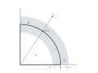

% Calcul Différential, Intégral et Stochastique  
  MINES ParisTech/UE 11 -- Examen
%
% 3 novembre 2020, 9h--12h

\newcommand{\N}{\mathbb{N}}
\newcommand{\R}{\mathbb{R}}
\newcommand{\Esp}{\mathbb{E}}

# Coques fines

Dans ce problème, $\|\cdot\|$ désigne la norme euclidienne dans $\R^2$ et
$d$ la distance associée.
$$
\|(x_1, x_2)\| := \sqrt{x_1^2 + x_2^2} \; \mbox{ et } \; d(x, y) := \|y - x\|.
$$
Le symbole $U$ désigne le 
sous-ensemble du plan constitué des points d'abscisse et d'ordonnée
strictement positives
et $C$ l'arc de cercle constitué des points de $U$ 
à distance $1$ de l'origine.
$$
U = \{(x_1,x_2) \in \R^2 \; | \; \mbox{$x_1 > 0$ et $x_2 > 0$}\}
\; \mbox{ et } \;
C = \{x \in U \; | \; \|x\| = 1\}.
$$

On définit la projection $p$ sur
l'arc de cercle $C$ comme la fonction :
$$
p: x \in U \mapsto \frac{x}{\|x\|} \in C.
$$
On rappelle que cette projection $p(x)$ minimise la distance entre $x \in U$ et $C$ :
$$
d(x, p(x)) = \min_{y \in C} d(x, y) =: d(x, C).
$$

Finalement, pour tout $\varepsilon \in \left]0, 1\right]$, 
on définit la coque de $C$ d'épaisseur $2 \varepsilon$ par
$$
V_{\varepsilon} := \{x \in U \; | \; d(x,C) < \varepsilon\}.
$$

 \

## Topologie

#### Question 0
Montrer que l'ensemble $U$ est un ouvert de $\R^2$.
Montrer que pour tout $\varepsilon \in \left]0, 1\right]$ 
$$
V_{\varepsilon} = U \cap \{x \in \R^2 \; | \; 1- \varepsilon < \|x\| < 1 + \varepsilon \},
$$
et en déduire que les ensembles $V_{\varepsilon}$ sont également des ouverts 
de $\R^2$.

## Calcul Différentiel

#### Question 1
Montrer que les dérivées partielles de la fonction $x\in U \mapsto \|x\| \in \R$
existent et en déduire la valeur de
$$
n(x) := \nabla \|x\|.
$$
La fonction $x\in U \mapsto \|x\| \in \R$ est-elle continûment différentiable ?

#### Question 2
Montrer l'existence et calculer la valeur de $\nabla(1/\|x\|)$ quand $x\in U$. 

#### Question 3 
Montrer que si deux fonctions $f: U \mapsto \R$ et $g: U \mapsto \R^2$ sont
différentiables, alors le produit $fg$ également. 
Calculer la jacobienne $J_{fg}(x)$ en fonction de $\nabla f(x)$ et $J_g(x)$.

#### Question 4
Montrer que $p$ est différentiable et que 
$$
J_p(x) = \frac{1}{\|x\|} P(x) \; \mbox{ où } \; P(x) =  I - n(x) \cdot n(x)^{\top}.
$$
($I$ désigne la matrice identité de $\mathbb{R}^2$.)

#### Question 5
On pose
$$
h(x) = p(x) + \varepsilon (x - p(x)).
$$
Montrer que $h: V_1 \to V_{\varepsilon}$ est une bijection et
déterminer $h^{-1}(y)$ quand $y \in V_{\varepsilon}$.

#### Question 6
Calculer $J_{h}(x)$ et 
montrer que $h$ est un $C^1$-difféomorphisme.

#### Question 7
Etablir que
$$
\det J_{h}(x) = \varepsilon 
\left(
\varepsilon + \frac{1-\varepsilon}{\|x\|} \right).
$$

## Calcul Intégral

#### Question 8
On note $S := [0,2] \times [0,2] \subset \mathbb{R}^2$.  Que vaut l'intégrale
$$
\int_{\R^2} 1_S(x) \, dx
$$
et pourquoi ? (On ne demande pas de justifier l'existence de l'intégrale).

#### Question 9
Calculer $(-t(\ln t - 1))'$ pour $t>0$ et en déduire que 
$$
\int_{\varepsilon}^2 (- \ln t) \, dt \to -2(\ln 2 - 1) \; \mbox{ quand } \;
\varepsilon \to 0, \; \varepsilon > 0.
$$
En déduire que la fonction de $\mathbb{R}$ dans $\mathbb{R}$ égale à $-\ln t$ 
quand $t \in \left]0, 2\right]$ et nulle sinon est intégrable sur $[0, 2]$.
Est-ce que l'on pourrait se passer de la mention "et nulle sinon"
pour répondre à cette dernière question ?

#### Question 10
Montrer l'existence et calculer
$$
\int_0^2 \frac{dx_1}{\sqrt{x_1^2 + x_2^2}}
$$
quand $x_2 \in \left]0, 2\right]$. 
Indication : $\partial_{x_1} \left( \ln \left(x_1 + \sqrt{x_1^2 + x_2^2} \right) \right) = 1/\sqrt{x_1^2 + x_2^2}$ (la preuve de cette égalité n'est pas exigée).

#### Question 11
Montrer que la frontière $\partial S$ de l'ensemble $S$ dans $\R^2$ est négligeable. 
(On donnera $\partial S$ sans justification.) 
En déduire que la fonction
$$
x \in \R^2
\mapsto 
\left|
\begin{array}{rl}
1 / \|x\| & \mbox{si $x \in S$ et $x \neq (0,0)$,} \\
0 & \mbox{sinon.}
\end{array}
\right.
$$
est mesurable. Puis, déduire des questions précédentes son intégrabilité.

#### Question 12
Soit $f: C \to \R$ une fonction bornée telle que $f \circ p: U \to \R$ soit mesurable
(c'est-à-dire que son prolongement par $0$ à $\R^2$ est mesurable).
Soit $\varepsilon \in \left]0, 1\right]$.
Montrer que l'intégrale
$$\frac{1}{2\varepsilon} \int_{V_{\varepsilon}} f(p(y)) \, dy$$
est bien définie.

#### Question 13
Montrer que
$$
\frac{1}{2\varepsilon} \int_{V_{\varepsilon}} f(p(y)) \, dy=\frac{1}{2} \int_{V_1} f(p(x)) \left(
\varepsilon + \frac{1-\varepsilon}{\|x\|} \right) \, dx.
$$

#### Question 14
Déduire des questions précédentes l'existence et la valeur de
$$
\lim_{\substack{\varepsilon \to 0\\\varepsilon \in \left]0,1\right]}}
\frac{1}{2\varepsilon} \int_{V_{\varepsilon}} f(p(y)) \, dy.
$$

# Probabilités --- Loi de Maxwell 

On désire déterminer la distribution des vitesses des molécules d’un gaz monoatomique parfait à l’équilibre (loi de Maxwell (1859)).

On représente la vitesse d’une molécule d’un gaz monoatomique parfait à l’équilibre dans un repère orthonormal par un vecteur aléatoire $V = (V_1 , V_2 , V_3 )$. Le choix du repère étant arbitraire, il est naturel de supposer que la loi de $V$ est invariante par rotation (autour de l'origine) et que les composantes de $V$ sont indépendantes.

## Partie 1 

Soit $(X, Y, Z)$ un vecteur aléatoire  à valeurs dans $\R^3$ de densité $f_{(X, Y, Z)}$.
Ce vecteur aléatoire est supposé invariant par rotation : il existe une fonction $\phi: \left[0, +\infty\right[ \to \left]0, +\infty\right[$ (strictement positive) telle que
$$
f_{(X, Y, Z)}(x,y,z) = \phi(x^2+y^2+z^2) \;  \mbox{ pour tout $(x, y, z) \in \R^3$.}
$$ 

<!--
#### Question 0
Soit $(X, Y, Z)$ un vecteur aléatoire  à valeurs dans $\R^3$ de densité $f_{(X, Y, Z)}$.
Montrer que l'ensemble 
$$
P = \{ (x,y,z) \in \R^3 \; | \; f_{(X, Y, Z)}(x,y,z) \neq 0 \}
$$ 
n'est pas négligeable (c'est-à-dire que son volume est strictement positif).
-->

#### Question 1
On suppose de plus les variables aléatoires
$X$, $Y$ et $Z$ indépendantes. Montrer qu'il existe une fonction
$f: \R \to \left[0, +\infty\right[$ qui soit une densité telle que 
$$
f_{(X, Y, Z)}(x, y, z) = f(x) f(y) f(z) \; \mbox{ pour tout $(x, y, z) \in \R^3$.} 
$$
Montrer finalement que $f(x) > 0$ pour tout $x \in \R$.

#### Question 2

On suppose de plus que les densités marginales de $X, Y$ et $Z$ ainsi que la fonction $\phi$ sont continûment différentiables (c'est-à-dire de classe $C^1$). Montrer que la densité de chacune des composantes s'écrit sous la forme $f (x) = a e^{cx^2/2}$, avec $a$ et $c$ deux constantes réelles.

#### Question 3

En déduire que le vecteur $(X, Y, Z)$ suit une loi gaussienne d'espérance l'origine dont on précisera la matrice de covariance en fonction de la constante $\sigma = 1/\sqrt{|c|}$.

## Partie 2

On suppose que le vecteur aléatoire $(X, Y, Z) = V$ vérifie les hypothèses des
questions précédentes. 

#### Question 4

Calculer l'énergie cinétique moyenne d'un atome du gaz, c'est-à-dire l'espérance 
$$
E_c := \mathbb{E}\left(\frac{1}{2}m\|V\|^2\right)
$$ 
où $m$ est la masse d'un atome du gaz.
L’énergie cinétique moyenne d’un atome du gaz de masse $m$ étant égale à $\frac{3}{2} kT$ où $k$ est la constante de Boltzmann et $T$ la température du gaz, en déduire la valeur de
$\sigma^2$ en fonction de $k$, $T$ et $m$.

#### Question 5

On rappelle que si $X$ et $Y$ sont deux variables aléatoires indépendantes de loi respective $\Gamma (a,\lambda)$ et $\Gamma (b,\lambda)$, alors la loi de $X + Y$ est la loi $\Gamma (a+b,\lambda)$. On rappelle également que la densité $g$ de la loi $\Gamma (a,\lambda)$ vérifie
$$
g(x) = \frac{1}{\Gamma(a)}\lambda^a x^{a -1} e^{-\lambda x} 1_{]0,+\infty[}(x)
\; \mbox{ pour tout $x\in\R$},
$$
où $\Gamma$ est la fonction définie par
$$\Gamma(a) = \int_0^{+\infty} x^{a-1}e^{-x} dx \text{ pour } a \in \left] 0, + \infty \right[.$$
On remarquera que $\Gamma(1/2) = \sqrt{\pi}$ et que $\Gamma(x+1) = x \Gamma(x).$ 

Calculer la loi de $V_1^2$. 
En déduire la loi de $\|V \|^2$ puis la densité de $\|V \| = \sqrt{V_1^2 + V_2^2 + V_3^2}$.
La probabilité associée est appelée loi de Maxwell.
